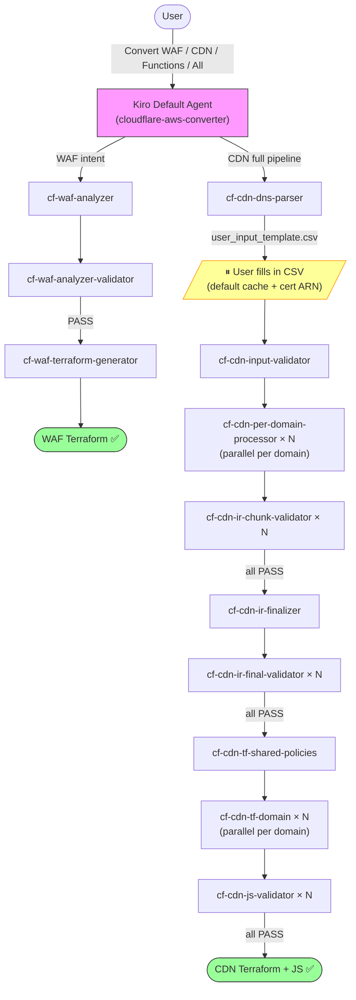

# Cloudflare to AWS Edge Migration Tool | [中文](./README_CN.md)

**Automatically convert Cloudflare configurations to AWS edge service configurations through AI conversation**

---

## ⚠️ CRITICAL: Required Input Format

**This tool ONLY works with configuration files generated by [CloudflareBackup](https://github.com/chenghit/CloudflareBackup).**

**❌ NOT COMPATIBLE with [cf-terraforming](https://github.com/cloudflare/cf-terraforming)** — cf-terraforming requires users to manually specify output file names and paths, producing unpredictable file structures that AI skills cannot reliably process. See [Why Not cf-terraforming?](./docs/why-not-cf-terraforming.md) for details.

---

## Why This Tool

Manually converting hundreds of rules when migrating from Cloudflare to AWS is time-consuming and error-prone. This tool leverages GenAI capabilities to automate batch configuration conversion through conversational interaction, reducing migration time from days to hours.

## Features

| Skill | Input | Output | Status |
|-------|-------|--------|--------|
| **cf-waf-analyzer** | Cloudflare security rules (WAF, Rate Limiting, IP Access, etc.) | Security rules summary with conversion plan | ✅ Available |
| **cf-waf-analyzer-validator** | Security rules summary | Validated summary (fixes errors in-place) | ✅ Available |
| **cf-waf-terraform-generator** | Validated security rules summary | AWS WAF configuration (Terraform) | ✅ Available |
| **cf-cdn-dns-parser** | Cloudflare DNS backup | Domain manifest + user input template CSV | ✅ Available |
| **cf-cdn-input-validator** | User-confirmed domain CSV | Validated domain scope JSON | ✅ Available |
| **cf-cdn-per-domain-processor** | Cloudflare CDN rules (all types) | CloudFront-native IR accumulator YAML per domain | ✅ Available |
| **cf-cdn-ir-chunk-validator** | IR accumulator YAML | Validation report (adversarial checker) | ✅ Available |
| **cf-cdn-ir-finalizer** | All domain IR accumulators | Sorted final IR + dedup manifest + conversion report | ✅ Available |
| **cf-cdn-ir-final-validator** | Final IR YAML | Validation report (adversarial checker) | ✅ Available |
| **cf-cdn-tf-shared-policies** | Dedup manifest | Shared Terraform policies (CachePolicy, etc.) | ✅ Available |
| **cf-cdn-tf-domain** | Final IR per domain | CloudFront Terraform + CloudFront Functions JS | ✅ Available |
| **cf-cdn-js-validator** | Generated JS functions | JS validation report (syntax + runtime constraints) | ✅ Available |

Each skill runs in a separate Kiro subagent with isolated context. The default agent loads the `cloudflare-aws-converter` orchestrator skill and automatically dispatches to the appropriate subagents.



## CDN Full Pipeline: What Happens

The CDN pipeline converts all Cloudflare CDN configurations (Cache Rules, Origin Rules, Redirect Rules, URL Rewrites, Header Transforms, Bulk Redirects, Compression Rules, Custom Error Rules, and more) into working Terraform for AWS CloudFront.

**One user interaction point:** After parsing DNS records, the tool generates a CSV template. You fill in two columns per domain — whether to apply Cloudflare's default 2-hour cache for 70+ file extensions, and optionally your ACM certificate ARN. Everything else is fully automated.

**Output structure:**
```
cloudflare-to-aws-cdn/
├── user_input_template.csv          # Fill this in, save as user_input.csv
├── dns_manifest.yaml
├── domain_scope.json
├── conversion_report.md             # Non-convertible rules + warnings
├── ir/
│   ├── accumulator/                 # Per-domain CloudFront-native IR
│   ├── final/                       # Sorted, deduplicated IR
│   └── validation/                  # Validator reports (V1, V2, V3)
└── terraform/
    ├── modules/
    │   └── cloudfront_distribution/ # Shared module (copied from skill)
    ├── shared/
    │   └── policies.tf              # Deduplicated CachePolicy resources + outputs
    └── domains/
        └── <domain>/
            ├── main.tf              # module call (~50-80 lines)
            ├── outputs.tf
            ├── functions.tf
            ├── kvs.tf               # KVS store (if bulk redirects exist)
            ├── functions/
            │   └── viewer_request.js
            └── lambda/              # Lambda@Edge (only if CF Function too large)
```

**ACM certificates:** Add your certificate ARN in the CSV, or leave blank — the tool generates a `data "aws_acm_certificate"` lookup that finds your existing ISSUED cert automatically at `terraform plan` time.

**Logging:** CloudFront access logging is not configured by this tool — it involves decisions (S3 bucket region, log format, shared vs. per-domain buckets) that are outside the scope of config migration. Add a `logging_config` block to the generated `main.tf` if needed.

**Design target:** Tested with up to 50 proxied domains per zone. Larger zones should work — each subagent processes one domain in isolation, so the orchestrator's context usage scales linearly. The main constraint is CloudFront KVS quota (default 50 per account, soft limit — [request an increase](https://docs.aws.amazon.com/servicequotas/latest/userguide/request-quota-increase.html) before running if you have more than 50 domains that use bulk redirects). One KVS per domain, no cross-domain sharing.

**Single zone per run:** This tool converts one Cloudflare zone at a time. If your backup directory contains multiple zones, the orchestrator will detect this and ask you to specify which zone to convert. Run the tool once per zone.

**Parallel batch size:** The pipeline processes multiple domains in parallel at 5 stages (processing, V1 validation, V2 validation, Terraform generation, JS validation). The default batch size is **2 domains at a time** — conservative enough to avoid LLM API rate limits on most platforms (Anthropic API Tier 1: 50 RPM, AWS Bedrock default: as low as 2-10 RPM for new accounts). If your API quota is higher, you can increase the batch size by editing the "Parallel batch size" rule in `cloudflare-aws-converter/SKILL.md`. Anthropic Tier 2+ (1,000+ RPM) or Bedrock with approved quota increase (200+ RPM) can safely use batch size 4 (the Kiro CLI maximum).

**Deployment order:** The generated Terraform uses independent root modules. Apply in this order:

```bash
# 1. Shared policies first (creates CachePolicy, ORP, RHP resources)
cd cloudflare-to-aws-cdn/terraform/shared
terraform init && terraform apply

# 2. Each domain independently (looks up shared policies by name via data sources)
cd cloudflare-to-aws-cdn/terraform/domains/cdn_example_com
terraform init && terraform apply
```

Each domain can be planned and applied independently after the shared policies exist. This keeps blast radius small — changing one domain doesn't affect others.

## Quick Start

```bash
# 1. Install Kiro CLI
curl -fsSL https://cli.kiro.dev/install | bash

# 2. Backup Cloudflare configuration
# Use: https://github.com/chenghit/CloudflareBackup

# 3. Install skills
git clone https://github.com/chenghit/cloudflare-aws-edge-config-converter.git
cd cloudflare-aws-edge-config-converter
./install.sh

# 4. Start conversion
kiro-cli chat
```

Then just describe what you want:

```
Convert Cloudflare security rules in /path/to/cloudflare-backup to AWS WAF
Convert CDN configuration in /path/to/cloudflare-backup to CloudFront Terraform
Convert all Cloudflare configuration in /path/to/cloudflare-backup to AWS
```

For testing without your own config, use `examples/cloudflare-configs/`.

## Prerequisites

### ACM Certificates (CDN pipeline only)

CloudFront requires TLS certificates in **us-east-1** (N. Virginia). Before running the CDN pipeline, provision wildcard certificates for your domains:

```bash
# Example: request a wildcard cert for *.example.com
aws acm request-certificate \
  --domain-name "*.example.com" \
  --validation-method DNS \
  --region us-east-1
```

Complete DNS validation and wait for status `ISSUED`. You'll enter the certificate ARN in the CSV template during the pipeline, or leave it blank to let Terraform look up an existing ISSUED cert by domain name automatically.

### Terraform

AWS WAF and CloudFront output requires Terraform >= 1.8.0 and AWS Provider >= 6.x.

```bash
terraform version
# Upgrade: https://developer.hashicorp.com/terraform/install
```

### Kiro CLI

- Installation: https://kiro.dev/docs/getting-started/installation/
- Skills support: Since version 1.24
- ⚠️ Kiro IDE is not recommended — it does not support `skill://` resource binding in subagents, breaking context isolation.

### Model Selection

> ⚠️ **Minimum Required Model: `claude-sonnet-4.6`**
>
> Earlier models see skill metadata but do not load the full SKILL.md body, causing tasks to fail.

- `claude-sonnet-4.6` — Recommended for WAF conversion and small CDN configs (< 10 domains)
- `claude-sonnet-4.6-1m` — Required for CDN migration with many domains (> 10) or large rule sets. Switch with `/model` in Kiro.

## Installation

```bash
git clone https://github.com/chenghit/cloudflare-aws-edge-config-converter.git
cd cloudflare-aws-edge-config-converter
./install.sh    # Copies skills to ~/.kiro/skills/, subagent configs to ~/.kiro/agents/
```

Update: `git pull && ./install.sh`

> **Using a different agent tool?** The install scripts and all SKILL.md files use `~/.kiro/skills/` as the default skill directory (Kiro CLI convention). To use these skills with another agent tool, you need to: (1) modify `install.sh` / `uninstall.sh` to point to your tool's skill directory, and (2) find-and-replace `~/.kiro/skills/` with your tool's skill path across all SKILL.md files — subagents reference each other by absolute installed path.

### Manual Subagent Control

For advanced users: `/agent swap <subagent-name>` to run individual pipeline stages.

Available subagents: `cf-waf-analyzer`, `cf-waf-analyzer-validator`, `cf-waf-terraform-generator`, `cf-cdn-dns-parser`, `cf-cdn-input-validator`, `cf-cdn-per-domain-processor`, `cf-cdn-ir-chunk-validator`, `cf-cdn-ir-finalizer`, `cf-cdn-ir-final-validator`, `cf-cdn-tf-shared-policies`, `cf-cdn-tf-domain`, `cf-cdn-js-validator`.

## Subagent Permissions and Security

Most subagents only have file I/O and search permissions (`fs_read`, `fs_write`, `glob`, `grep`). One subagent requires shell execution:

| Subagent | Has `execute_bash` | Why |
|----------|-------------------|-----|
| `cf-cdn-js-validator` | ✅ Yes | Runs `node --check <file>` for JavaScript syntax validation and `wc -c` for file size checks. These are the only two commands it needs — there is no way to validate JS syntax or measure byte-accurate file size with file I/O tools alone. |
| All other subagents | ❌ No | Only need to read/write files and search text. |

**If your security policy flags `execute_bash`:** You can review the validator's SKILL.md to confirm it only runs `node --check` and `wc -c`. Removing `execute_bash` from `cf-cdn-js-validator.json` will disable JS syntax checking (CFF-01, LE-01) and byte-accurate size validation (CFF-06, LE-03) — the validator will skip these checks and report them as `SKIP` in the output JSON.

**Do not use manual approval as a workaround.** Subagents run inside the orchestrator's context — when the main agent dispatches a task to a subagent, you do not see individual tool calls from that subagent in your chat. Manual approval per-call is not possible for subagent tool invocations, so removing the permission and relying on interactive approval is not a viable alternative.

## More Information

- [Best Practices](./docs/best-practices.md)
- [Limitations and Caveats](./docs/limitations.md)
- [Troubleshooting](./docs/troubleshooting.md)
- [Why Not cf-terraforming?](./docs/why-not-cf-terraforming.md)
- [Roadmap](./docs/roadmap.md)

## Related Resources

- [Kiro Documentation](https://kiro.dev/docs/)
- [Agent Skills Support in Kiro CLI](https://kiro.dev/changelog/cli/1-24/)
- [AWS WAF Documentation](https://docs.aws.amazon.com/waf/)
- [CloudFront Developer Guide](https://docs.aws.amazon.com/AmazonCloudFront/latest/DeveloperGuide/)
- [CloudFront Functions Runtime 2.0](https://docs.aws.amazon.com/AmazonCloudFront/latest/DeveloperGuide/functions-javascript-runtime-20.html)

## License

[MIT](./LICENSE)

## Feedback and Contributions

For issues or suggestions, please submit an Issue or Pull Request.
