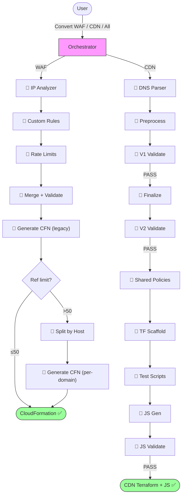

# Cloudflare to AWS Edge Migration Tool | [中文](./README_CN.md)

**Automatically convert Cloudflare configurations to AWS edge service configurations through AI conversation**

This tool reads [CloudflareBackup](https://github.com/chenghit/CloudflareBackup) exports and generates ready-to-deploy AWS WAF (CloudFormation) and CloudFront (Terraform) configurations — including cache policies, CloudFront Functions, Lambda@Edge, and KVS data.

## Quick Start

```bash
# 1. Install Kiro CLI (https://kiro.dev)
curl -fsSL https://cli.kiro.dev/install | bash

# 2. Backup your Cloudflare config
# Use: https://github.com/chenghit/CloudflareBackup

# 3. Install skills
git clone https://github.com/chenghit/cloudflare-aws-edge-config-converter.git
cd cloudflare-aws-edge-config-converter
./install.sh

# 4. Start conversion
kiro-cli chat
```

Then describe what you want:

```
Convert Cloudflare security rules in /path/to/cloudflare-backup to AWS WAF
Convert CDN configuration in /path/to/cloudflare-backup to CloudFront Terraform
Convert all Cloudflare configuration in /path/to/cloudflare-backup to AWS
```

Always provide the **CloudflareBackup root directory** (the one containing `account/` and zone subdirectories like `example.com/`). Do **not** provide a subdirectory — both WAF and CDN pipelines need files from the `account/` directory (IP lists for WAF, bulk redirect lists for CDN) that live outside the zone directory.

For testing without your own config, use `examples/cloudflare-configs/`.

## Prerequisites

- **Kiro CLI** >= 1.24 — [Installation guide](https://kiro.dev/docs/getting-started/installation/).
- **Terraform** >= 1.8.0 with AWS Provider >= 6.x — [Install Terraform](https://developer.hashicorp.com/terraform/install). Required for CDN pipeline only. WAF pipeline uses CloudFormation (no Terraform needed).
- **Python 3** — Required by both WAF and CDN pipeline scripts. WAF pipeline is entirely Python-based (expression parsing, analysis, validation, CloudFormation generation). CDN uses Python for rule preprocessing, IR validation, and finalization (Stages 3–7.6). Pre-installed on macOS and most Linux distributions. No third-party packages needed for the conversion pipeline (stdlib only). **Post-conversion**: CDN domains with KVS (bulk redirects, IP lists, error pages) generate a `seed-kvs.py` script that requires `boto3` — install with `pip install boto3` before deploying.
- **Model**: No model requirement for the conversion pipeline itself — all scripts are deterministic Python with zero LLM invocations. Any model supported by Kiro CLI works, since the orchestrator only needs to understand user intent, run shell commands, and translate deployment guides for non-English users.
- **ACM certificates** (CDN only): CloudFront requires certs in us-east-1. Provision wildcard certificates (e.g., `*.example.com`) before running. Terraform auto-discovers existing ISSUED certs via data source lookup.
- **Input format**: Only works with [CloudflareBackup](https://github.com/chenghit/CloudflareBackup) exports. NOT compatible with [cf-terraforming](https://github.com/cloudflare/cf-terraforming) — see [Why Not cf-terraforming?](./docs/why-not-cf-terraforming.md).

## What Gets Converted

| Cloudflare | AWS Equivalent | Pipeline |
|------------|---------------|----------|
| WAF rules, Rate Limiting, IP Access | AWS WAF Web ACL (CloudFormation) | WAF |
| Cache Rules | CloudFront cache policies + cache behaviors | CDN |
| Origin Rules | CloudFront Functions (`updateRequestOrigin`) or cache behaviors | CDN |
| Redirect Rules | CloudFront Functions (viewer-request) | CDN |
| URL Rewrite Rules | CloudFront Functions (viewer-request) | CDN |
| Bulk Redirects | KVS + CloudFront Functions | CDN |
| Request Header Transform | CloudFront Functions + Origin Request Policy | CDN |
| Response Header Transform | Response Headers Policy + CloudFront Functions | CDN |
| Compression Rules | Cache policy `enable_gzip` / `enable_brotli` | CDN |
| Custom Error Rules | CloudFront custom error responses | CDN |
| Cloud Connector Rules | Independent cache behaviors with separate origins | CDN |

Not all Cloudflare features have CloudFront equivalents. Non-convertible items are recorded in `conversion_report.md` for manual review — never silently dropped. See [Limitations and Caveats](./docs/limitations.md) for the complete list.

## How It Works

The tool runs as a Kiro CLI skill with an orchestrator that runs deterministic Python scripts for both WAF and CDN pipelines.

**WAF pipeline** (all Python, zero LLM): analyze IP lists → analyze custom rules → analyze rate limits → merge → validate → generate CloudFormation → **auto-fallback to per-domain split if ref limit exceeded**

The WAF pipeline first tries legacy mode (2 WebACLs). If IP set reference statements exceed the per-WebACL hard limit of 50, it automatically falls back to per-domain WebACLs (one per proxied domain). In per-domain mode, host-specific rules are placed only in the relevant domain's WebACL, and host conditions are stripped (redundant when a WebACL serves one domain). Each WebACL includes search engine labeling (Googlebot/Bingbot/YandexBot), Anti-DDoS with search engine exclusion, and an always-on challenge rule (Count mode — user activates after review).

**CDN pipeline** (0 LLM stages + 10 Python scripts): **parse DNS + generate scope (Python)** → **preprocess rules (Python)** → **validate IR (Python)** → **finalize + dedup (Python)** → **validate final IR (Python)** → **generate shared policies (Python)** → **generate per-domain Terraform scaffold (Python)** → **generate per-domain test scripts (Python)** → **generate per-domain JS (Python)** → **validate JS (Python)**

All CDN stages are deterministic Python scripts. No LLM subagents. No user interaction — Stage 1 parses DNS and generates `domain_scope.json` automatically (all domains use Terraform data source for ACM cert lookup). The entire tool (WAF + CDN) is zero LLM.



**Fully automated:** No user interaction required. DNS parsing generates domain scope automatically. ACM certificates are looked up via Terraform data sources.

## CDN Pipeline Details

<details>
<summary>Output structure</summary>

```
cloudflare-to-aws-cdn/
├── dns_manifest.yaml
├── domain_scope.json
├── conversion_report.md             # Non-convertible rules + warnings
├── ir/                              # Intermediate representation (debug only)
│   ├── accumulator/
│   ├── final/
│   └── validation/
└── terraform/
    ├── modules/
    │   └── cloudfront_distribution/ # Shared module (do not edit)
    ├── shared/
    │   ├── policies.tf              # Deduplicated CachePolicy, ORP, RHP
    │   ├── functions.tf             # Shared CFF resources (content-hash dedup)
    │   ├── kvs-data.json            # Shared KVS data (if KVS dedup applies)
    │   └── seed-kvs.py             # Seed shared KVS after terraform apply
    └── domains/
        └── <domain>/
            ├── main.tf              # Module call (~50-80 lines)
            ├── outputs.tf
            ├── functions.tf         # Refs shared CFF or defines independent CFF
            ├── kvs.tf               # Only if bulk redirects exist
            ├── seed-kvs.py          # Only if KVS exists
            ├── test-cdn-rules.py    # Post-deployment validation script
            ├── functions/           # Only if domain has independent CFF
            │   └── <domain>_viewer_request.js
            └── lambda/              # Only if CF Function exceeds 10KB
```

</details>

<details>
<summary>Deployment order</summary>

Shared policies → Lambda@Edge (if any) → each domain independently → KVS data seeding → DNS cutover. See [Deployment Guide](./docs/deployment-guide.md) for step-by-step instructions.

</details>

<details>
<summary>Scaling and rate limits</summary>

- **Design target:** Tested with up to 54 proxied domains per zone. Larger zones should work — Python scripts process all domains in a single invocation.
- **Single zone per run.** Multiple zones detected → orchestrator asks you to pick one.
- **CFF quota:** Default 100 per account. Content-hash dedup automatically shares identical CFF across domains (e.g., 54 domains → 5 CFF). Only a concern if many domains have unique CFF logic.
- **KVS quota:** Default 50 per account (soft limit). Content-hash dedup shares identical KVS across domains (e.g., 54 domains → 2 KVS). [Request increase](https://docs.aws.amazon.com/servicequotas/latest/userguide/request-quota-increase.html) if still exceeded after dedup.

</details>

<details>
<summary>Expected conversion time</summary>

Conversion time depends on the number of rules/domains. Benchmark with the included `examples/cloudflare-configs/` (1 zone, 54 proxied domains, 80+ CDN rules + 20 WAF rules across 12+ rule types — including regex expressions, OR conditions, geo-based routing, CORS, bulk redirects, inline error pages, and KV store data):

| Pipeline | Time |
|----------|------|
| WAF | <1 second (all Python, no LLM) |
| CDN | <1 second (all Python, no LLM) |

Where the time goes:
- **WAF**: Entire Python pipeline finishes in <1 second (zero LLM invocations).
- **CDN**: All 10 Python stages finish in <1 second total. Fully automated, no user interaction.

Factors that affect conversion time:
- **Number of domains** does NOT affect performance — Python processes all domains in one invocation.

</details>

<details>
<summary>ACM certificates</summary>

CloudFront requires TLS certificates in **us-east-1**. Provision before running:

```bash
aws acm request-certificate \
  --domain-name "*.example.com" \
  --validation-method DNS \
  --region us-east-1
```

The tool generates a `data "aws_acm_certificate"` lookup that finds your existing ISSUED cert at `terraform plan` time.

</details>

<details>
<summary>What the tool does NOT configure</summary>

- **CloudFront access logging** — involves S3 bucket decisions outside migration scope. Add `logging_config` to `main.tf` if needed.
- **DNS cutover** — distributions are created but DNS records are not modified.

</details>

<details>
<summary>AWS WAF quotas to be aware of</summary>

- **IP sets per account per region**: 100 (soft limit, can request increase via support case)
- **IP set + regex set references per WebACL**: 50 (**hard limit**, cannot be increased via Service Quotas)
- **WebACLs per account per region**: 100 (soft limit)

The pipeline first tries legacy mode (2 WebACLs). If reference statements exceed the per-WebACL hard limit of 50, it automatically falls back to per-domain WebACLs and enables cross-rule IP set deduplication when inline IP sets exceed 100. The generated deployment README includes a Quota Usage section showing actual consumption vs limits. See [Why CloudFormation](./docs/why-cloudformation.md) for details.

</details>

## Installation

```bash
git clone https://github.com/chenghit/cloudflare-aws-edge-config-converter.git
cd cloudflare-aws-edge-config-converter
./install.sh    # Copies skill + scripts to ~/.kiro/skills/
```

Update: `git pull && ./install.sh`

> **Using a different agent tool?** The install script and SKILL.md use `~/.kiro/skills/` as the default skill directory (Kiro CLI convention). To use with another agent tool:
>
> ```bash
> cd cloudflare-aws-edge-config-converter
>
> # Replace skill path in SKILL.md
> sed -i '' 's|~/.kiro/skills/cloudflare-aws-converter|/your/skill/path|g' cloudflare-aws-converter/SKILL.md
>
> # Edit install.sh — change SKILLS_DIR at the top of the file
> ```

For advanced users: all pipeline stages are Python scripts — run them directly via `python3`. The WAF pipeline runs via `waf-pipeline.sh`. CDN stages are individual scripts in `cloudflare-aws-converter/scripts/`.

## More Information

- [Best Practices](./docs/best-practices.md)
- [Deployment Guide](./docs/deployment-guide.md)
- [Limitations and Caveats](./docs/limitations.md)
- [Troubleshooting](./docs/troubleshooting.md)
- [Why Not cf-terraforming?](./docs/why-not-cf-terraforming.md)
- [Why CloudFormation Instead of Terraform for WAF?](./docs/why-cloudformation.md)

## Related Resources

- [Kiro Documentation](https://kiro.dev/docs/)
- [Agent Skills Support in Kiro CLI](https://kiro.dev/changelog/cli/1-24/)
- [AWS WAF Documentation](https://docs.aws.amazon.com/waf/)
- [CloudFront Developer Guide](https://docs.aws.amazon.com/AmazonCloudFront/latest/DeveloperGuide/)
- [CloudFront Functions Runtime 2.0](https://docs.aws.amazon.com/AmazonCloudFront/latest/DeveloperGuide/functions-javascript-runtime-20.html)

## License

[MIT](./LICENSE)

## Feedback and Contributions

For issues or suggestions, please submit an Issue or Pull Request.
