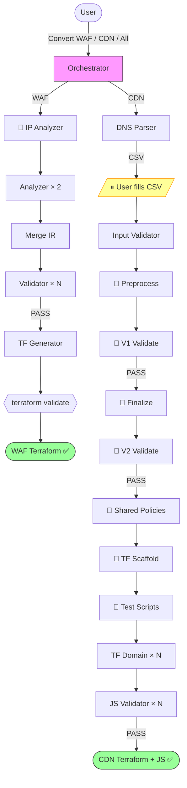

# Cloudflare to AWS Edge Migration Tool | [中文](./README_CN.md)

**Automatically convert Cloudflare configurations to AWS edge service configurations through AI conversation**

This tool reads [CloudflareBackup](https://github.com/chenghit/CloudflareBackup) exports and generates ready-to-deploy Terraform for AWS WAF and CloudFront — including cache policies, CloudFront Functions, Lambda@Edge, and KVS data.

## Quick Start

```bash
# 1. Install Kiro CLI (https://kiro.dev)
curl -fsSL https://cli.kiro.dev/install | bash

# 2. Backup your Cloudflare config
# Use: https://github.com/chenghit/CloudflareBackup

# 3. Install skills
git clone https://github.com/chenghit/cloudflare-aws-edge-config-converter.git
cd cloudflare-aws-edge-config-converter
./install.sh

# 4. Start conversion
kiro-cli chat
```

Then describe what you want:

```
Convert Cloudflare security rules in /path/to/cloudflare-backup to AWS WAF
Convert CDN configuration in /path/to/cloudflare-backup to CloudFront Terraform
Convert all Cloudflare configuration in /path/to/cloudflare-backup to AWS
```

Always provide the **CloudflareBackup root directory** (the one containing `account/` and zone subdirectories like `example.com/`). Do **not** provide a subdirectory — both WAF and CDN pipelines need files from the `account/` directory (IP lists for WAF, bulk redirect lists for CDN) that live outside the zone directory.

For testing without your own config, use `examples/cloudflare-configs/`.

## Prerequisites

- **Kiro CLI** >= 1.24 — [Installation guide](https://kiro.dev/docs/getting-started/installation/). ⚠️ Kiro IDE is not recommended (does not support `skill://` resource binding in subagents).
- **Terraform** >= 1.8.0 with AWS Provider >= 6.x — [Install Terraform](https://developer.hashicorp.com/terraform/install). Note: `terraform validate` (run automatically after WAF generation) requires internet access on first run to download the AWS provider (~300MB).
- **Python 3** — Required by both WAF and CDN pipeline scripts. WAF uses Python for IP list/access rule analysis and helper scripts for count validation and JSON chunking. CDN uses Python for rule preprocessing, IR validation, and finalization (Stages 3–7.6) — these replaced LLM subagents for deterministic, sub-second processing. Pre-installed on macOS and most Linux distributions. No third-party packages needed for the conversion pipeline (stdlib only). **Post-conversion**: CDN domains with KVS (bulk redirects, IP lists, error pages) generate a `seed-kvs.py` script that requires `boto3` — install with `pip install boto3` before deploying.
- **Model**: `claude-sonnet-4.6-1m` minimum. Switch with `/model` in Kiro.
  - **WAF migration**: `claude-sonnet-4.6-1m` for ≤ 100 rules, `claude-opus-4.6-1m` for > 100 rules. "Rules" = WAF Custom Rules + Rate Limiting Rules + IP Access Rules total. WAF pipeline supports up to ~200 CF rules; beyond that, consider simplifying rules in Cloudflare first or manual migration. The bottleneck for large rule sets is the Terraform generator's output — AWS WAF requires splitting Cloudflare rules that use top-level OR logic or mixed IPv4/IPv6 IP lists into multiple AWS WAF rules (e.g., a rule with 3 OR branches and mixed IPs becomes 6 AWS WAF rules). Typical split ratio is ~2x; simple zones ~1.5x, complex zones with many OR + mixed IP rules up to 3x. Each AWS WAF rule generates ~150 output tokens of HCL:
    - Sonnet 4.6 max output: 64K tokens → safe for ~200 AWS WAF rules (~100 CF rules)
    - Opus 4.6 max output: 128K tokens → safe for ~400 AWS WAF rules (~200 CF rules)
  - **CDN migration**: `claude-sonnet-4.6-1m` regardless of domain count. CDN Stages 3–7.6 are Python scripts (no LLM cost). The remaining LLM stages (DNS parsing, input validation, JS generation, JS validation) each process one domain independently and generate ~200 lines of output, well within Sonnet's 64K output limit. Opus is not needed for token capacity, but consider switching to Opus if Sonnet produces incorrect JavaScript for complex Cloudflare expressions (regex_replace, wildcard_replace with capture groups).
- **ACM certificates** (CDN only): CloudFront requires certs in us-east-1. Provision wildcard certificates (e.g., `*.example.com`) before running, or leave blank in the CSV to let Terraform auto-discover existing ISSUED certs.
- **Input format**: Only works with [CloudflareBackup](https://github.com/chenghit/CloudflareBackup) exports. NOT compatible with [cf-terraforming](https://github.com/cloudflare/cf-terraforming) — see [Why Not cf-terraforming?](./docs/why-not-cf-terraforming.md).

## What Gets Converted

| Cloudflare | AWS Equivalent | Pipeline |
|------------|---------------|----------|
| WAF rules, Rate Limiting, IP Access | AWS WAF Web ACL (Terraform) | WAF |
| Cache Rules | CloudFront cache policies + cache behaviors | CDN |
| Origin Rules | CloudFront Functions (`updateRequestOrigin`) or cache behaviors | CDN |
| Redirect Rules | CloudFront Functions (viewer-request) | CDN |
| URL Rewrite Rules | CloudFront Functions (viewer-request) | CDN |
| Bulk Redirects | KVS + CloudFront Functions | CDN |
| Request Header Transform | CloudFront Functions + Origin Request Policy | CDN |
| Response Header Transform | Response Headers Policy + CloudFront Functions | CDN |
| Compression Rules | Cache policy `enable_gzip` / `enable_brotli` | CDN |
| Custom Error Rules | CloudFront custom error responses | CDN |
| Cloud Connector Rules | Independent cache behaviors with separate origins | CDN |

Not all Cloudflare features have CloudFront equivalents. Non-convertible items are recorded in `conversion_report.md` for manual review — never silently dropped. See [Limitations and Caveats](./docs/limitations.md) for the complete list.

## How It Works

The tool runs as a Kiro CLI skill with an orchestrator that dispatches to specialized subagents. Each subagent has isolated context and handles one pipeline stage.

**WAF pipeline** (4 stages): **analyze IP lists (Python)** → analyze custom rules + rate limits (2 LLM batches) → merge + validate (parallel) → generate Terraform → terraform validate

**CDN pipeline** (4 LLM stages + 7 Python scripts): parse DNS → validate user input → **preprocess rules (Python)** → **validate IR (Python)** → **finalize + dedup (Python)** → **validate final IR (Python)** → **generate shared policies (Python)** → **generate per-domain Terraform scaffold (Python)** → **generate per-domain test scripts (Python)** → generate per-domain JS → validate JS

CDN Stages 3–7.6 are deterministic Python scripts that replaced LLM subagents. They handle rule parsing, field mapping, expression analysis, cache behavior assembly, policy deduplication, IR validation, shared policy generation, and per-domain Terraform scaffold — all table-lookup and structural operations that don't need LLM judgment. This makes Stages 3–7.6 instant (<1 second for any number of domains), fully reproducible, and eliminates ~30 minutes of LLM processing per zone. Stage 7.6 generates per-domain test scripts for post-deployment validation. The remaining LLM stages (8–9) handle JS code generation and validation, which genuinely benefits from language model capabilities.



**One user interaction point:** After DNS parsing, you fill in a CSV template (default cache behavior + optional cert ARN per domain). Everything else is fully automated.

## CDN Pipeline Details

<details>
<summary>Output structure</summary>

```
cloudflare-to-aws-cdn/
├── user_input_template.csv          # Fill this in, save as user_input.csv
├── dns_manifest.yaml
├── domain_scope.json
├── conversion_report.md             # Non-convertible rules + warnings
├── ir/                              # Intermediate representation (debug only)
│   ├── accumulator/
│   ├── final/
│   └── validation/
└── terraform/
    ├── modules/
    │   └── cloudfront_distribution/ # Shared module (do not edit)
    ├── shared/
    │   └── policies.tf              # Deduplicated CachePolicy, ORP, RHP
    └── domains/
        └── <domain>/
            ├── main.tf              # Module call (~50-80 lines)
            ├── outputs.tf
            ├── functions.tf
            ├── kvs.tf               # Only if bulk redirects exist
            ├── seed-kvs.py          # Only if KVS exists
            ├── test-cdn-rules.py    # Post-deployment validation script
            ├── functions/
            │   └── viewer_request.js
            └── lambda/              # Only if CF Function exceeds 10KB
```

</details>

<details>
<summary>Deployment order</summary>

Shared policies → Lambda@Edge (if any) → each domain independently → KVS data seeding → DNS cutover. See [Deployment Guide](./docs/deployment-guide.md) for step-by-step instructions.

</details>

<details>
<summary>Scaling and rate limits</summary>

- **Design target:** Tested with up to 50 proxied domains per zone. Larger zones should work — each subagent processes one domain in isolation.
- **Single zone per run.** Multiple zones detected → orchestrator asks you to pick one.
- **Parallel batch size: 2** (default). Conservative for Anthropic Tier 1 (50 RPM) and AWS Bedrock default quotas. To increase: open `cloudflare-aws-converter/SKILL.md`, search for `batch size 2` in the "Important Rules" section near the bottom, change `2` to `4` (Kiro CLI max). Tier 2+ or Bedrock with approved quota increase can safely use 4.
- **KVS quota:** Default 50 per account (soft limit). [Request increase](https://docs.aws.amazon.com/servicequotas/latest/userguide/request-quota-increase.html) if > 50 domains use bulk redirects.

</details>

<details>
<summary>Expected conversion time</summary>

Conversion time depends on the number of rules/domains, LLM API latency, and parallel batch size. Benchmark with the included `examples/cloudflare-configs/` (1 zone, 7 proxied domains, 34 CDN rules + 8 WAF rules across 12 rule types — including regex expressions, OR conditions, geo-based routing, CORS, bulk redirects, and inline error pages), using `claude-sonnet-4.6-1m` on Anthropic API:

| Pipeline | Parallel batch size 2 | Parallel batch size 4 |
|----------|----------------------|----------------------|
| WAF | ~15 min | ~10 min |
| CDN | ~32 min | ~20 min |

Where the time goes:
- **WAF**: Analyzer A2+A3 (~5 min), Validator V1-V4 (~5 min), Terraform generator (~3 min), terraform validate (~2 min). Python scripts (A1, merge, count, chunk, README) finish in <1 second total.
- **CDN**: Python scripts Stages 3–7.6 finish in <1 second total. Stage 8 JS generation (~15 min for 7 domains at batch size 2) and Stage 9 JS validation (~10 min) dominate. DNS parsing and input validation are ~2 min each.

Factors that affect conversion time:
- **Parallel batch size** is the biggest lever. Batch size 4 (Kiro CLI max) cuts CDN Stage 8+9 time nearly in half. Edit `cloudflare-aws-converter/SKILL.md` — search for "batch size" and change the number.
- **LLM API latency** varies by provider, region, and time of day. Anthropic direct API is typically faster than AWS Bedrock.
- **Number of domains** scales linearly for CDN Stages 8+9 (each domain is one subagent call). 50 domains at batch size 2 ≈ 25 batches × ~2 min each ≈ ~50 min for Stage 8 alone.
- **Rule complexity** affects individual subagent duration. Domains with many redirect/rewrite rules or complex expressions take longer for JS generation.

</details>

<details>
<summary>ACM certificates</summary>

CloudFront requires TLS certificates in **us-east-1**. Provision before running:

```bash
aws acm request-certificate \
  --domain-name "*.example.com" \
  --validation-method DNS \
  --region us-east-1
```

Or leave the cert ARN blank in the CSV — the tool generates a `data "aws_acm_certificate"` lookup that finds your existing ISSUED cert at `terraform plan` time.

</details>

<details>
<summary>What the tool does NOT configure</summary>

- **CloudFront access logging** — involves S3 bucket decisions outside migration scope. Add `logging_config` to `main.tf` if needed.
- **Lambda@Edge deployment** — code is generated but ARN placeholders must be filled after deploying. See [Deployment Guide](./docs/deployment-guide.md).
- **DNS cutover** — distributions are created but DNS records are not modified.

</details>

## Installation

```bash
git clone https://github.com/chenghit/cloudflare-aws-edge-config-converter.git
cd cloudflare-aws-edge-config-converter
./install.sh    # Copies skills to ~/.kiro/skills/, subagent configs to ~/.kiro/agents/
```

Update: `git pull && ./install.sh`

> **Using a different agent tool?** The install scripts and all SKILL.md files use `~/.kiro/skills/` as the default skill directory (Kiro CLI convention). To use these skills with another agent tool, you need to: (1) modify `install.sh` / `uninstall.sh` to point to your tool's skill directory, and (2) find-and-replace `~/.kiro/skills/` with your tool's skill path across all SKILL.md files — subagents reference each other by absolute installed path.

For advanced users: `/agent swap <subagent-name>` to run individual pipeline stages. Available subagents: `cf-waf-analyzer`, `cf-waf-analyzer-validator`, `cf-waf-terraform-generator`, `cf-cdn-dns-parser`, `cf-cdn-input-validator`, `cf-cdn-tf-domain`, `cf-cdn-js-validator`. CDN Stages 3–7.6 are Python scripts (not subagents) — run them directly via `python3`.

## Subagent Permissions and Security

### Why a dedicated orchestrator agent?

Kiro CLI subagents run in a restricted runtime with only `read`, `write`, `shell`, and `code` tools — they do not have access to `glob` or `grep` ([docs](https://kiro.dev/docs/cli/chat/subagents/#tool-availability)). When the default Kiro agent spawns subagents, each `shell` call triggers an interactive approval prompt, blocking the pipeline ([#4751](https://github.com/kirodotdev/Kiro/issues/4751)).

The `cloudflare-aws-converter` orchestrator agent solves this by declaring `trustedAgents: ["cf-*"]`, which lets all `cf-*` subagents run their `shell` calls without per-call approval. This is the only purpose of the orchestrator agent — it does not change what tools subagents can access.

### Subagent tool access

All subagents have the same runtime tools (`read`, `write`, `shell`, `code`). The `cf-cdn-js-validator` is the only subagent that intentionally uses `shell` for validation:

| Subagent | Uses `shell` | Why |
|----------|-------------|-----|
| `cf-cdn-js-validator` | ✅ Intentionally | Runs `node --check <file>` for JS syntax validation and `wc -c` for file size checks. |
| All other subagents | ⚠️ Incidentally | May use `ls` for directory discovery since `glob` is not available in subagent runtime. |

**If your security policy requires reviewing shell commands:** The orchestrator's `trustedAgents` setting only suppresses the approval prompt — it does not grant additional capabilities. Subagents can only run `shell` commands regardless of trust settings. You can audit each subagent's SKILL.md to see what commands it might run.

**To disable trust and require manual approval:** Remove the `toolsSettings.subagent.trustedAgents` field from `cloudflare-aws-converter.json`. Each `shell` call will then prompt for approval, but this will significantly slow down the pipeline.

## More Information

- [Best Practices](./docs/best-practices.md)
- [Deployment Guide](./docs/deployment-guide.md)
- [Limitations and Caveats](./docs/limitations.md)
- [Troubleshooting](./docs/troubleshooting.md)
- [Why Not cf-terraforming?](./docs/why-not-cf-terraforming.md)

## Related Resources

- [Kiro Documentation](https://kiro.dev/docs/)
- [Agent Skills Support in Kiro CLI](https://kiro.dev/changelog/cli/1-24/)
- [AWS WAF Documentation](https://docs.aws.amazon.com/waf/)
- [CloudFront Developer Guide](https://docs.aws.amazon.com/AmazonCloudFront/latest/DeveloperGuide/)
- [CloudFront Functions Runtime 2.0](https://docs.aws.amazon.com/AmazonCloudFront/latest/DeveloperGuide/functions-javascript-runtime-20.html)

## License

[MIT](./LICENSE)

## Feedback and Contributions

For issues or suggestions, please submit an Issue or Pull Request.
