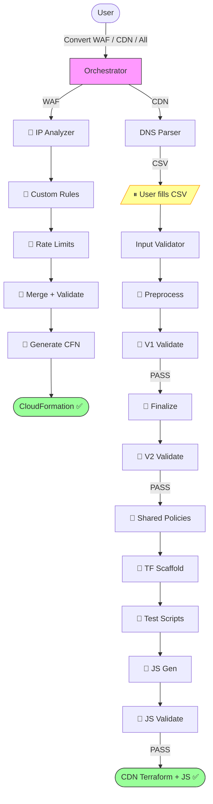

# Cloudflare to AWS Edge Migration Tool | [中文](./README_CN.md)

**Automatically convert Cloudflare configurations to AWS edge service configurations through AI conversation**

This tool reads [CloudflareBackup](https://github.com/chenghit/CloudflareBackup) exports and generates ready-to-deploy AWS WAF (CloudFormation) and CloudFront (Terraform) configurations — including cache policies, CloudFront Functions, Lambda@Edge, and KVS data.

> **⚠️ Kiro CLI 1.28.0 is incompatible with this tool.** Version 1.28.0 (released 2026-03-20) had two bugs that broke subagent pipelines: shell approval blocking ([#4751](https://github.com/kirodotdev/Kiro/issues/4751)) and subagent result return failure ([#6163](https://github.com/kirodotdev/Kiro/issues/6163)). Both were fixed in **1.28.1**. If you're on 1.28.0, upgrade:
> ```bash
> curl -fsSL https://cli.kiro.dev/install | bash
> ```
> Kiro CLI 1.24–1.27 and 1.28.1+ all work correctly.

## Quick Start

```bash
# 1. Install Kiro CLI (https://kiro.dev)
curl -fsSL https://cli.kiro.dev/install | bash

# 2. Backup your Cloudflare config
# Use: https://github.com/chenghit/CloudflareBackup

# 3. Install skills
git clone https://github.com/chenghit/cloudflare-aws-edge-config-converter.git
cd cloudflare-aws-edge-config-converter
./install.sh

# 4. Start conversion
kiro-cli chat
```

Then describe what you want:

```
Convert Cloudflare security rules in /path/to/cloudflare-backup to AWS WAF
Convert CDN configuration in /path/to/cloudflare-backup to CloudFront Terraform
Convert all Cloudflare configuration in /path/to/cloudflare-backup to AWS
```

Always provide the **CloudflareBackup root directory** (the one containing `account/` and zone subdirectories like `example.com/`). Do **not** provide a subdirectory — both WAF and CDN pipelines need files from the `account/` directory (IP lists for WAF, bulk redirect lists for CDN) that live outside the zone directory.

For testing without your own config, use `examples/cloudflare-configs/`.

## Prerequisites

- **Kiro CLI** >= 1.24 — [Installation guide](https://kiro.dev/docs/getting-started/installation/). ⚠️ Kiro IDE is not recommended (does not support `skill://` resource binding in subagents). **Avoid Kiro CLI 1.28.0** — it has two bugs ([#4751](https://github.com/kirodotdev/Kiro/issues/4751), [#6163](https://github.com/kirodotdev/Kiro/issues/6163)) that break subagent pipelines. Both are fixed in 1.28.1. **Kiro CLI 1.29.x** has a regression where subagents without an explicit `model` field fail with `Missing modelId` ([#7321](https://github.com/kirodotdev/Kiro/issues/7321)). Workaround: add `"model": "claude-sonnet-4.6"` to every agent config in `~/.kiro/agents/`.
- **Terraform** >= 1.8.0 with AWS Provider >= 6.x — [Install Terraform](https://developer.hashicorp.com/terraform/install). Required for CDN pipeline only. WAF pipeline uses CloudFormation (no Terraform needed).
- **Python 3** — Required by both WAF and CDN pipeline scripts. WAF pipeline is entirely Python-based (expression parsing, analysis, validation, CloudFormation generation). CDN uses Python for rule preprocessing, IR validation, and finalization (Stages 3–7.6). Pre-installed on macOS and most Linux distributions. No third-party packages needed for the conversion pipeline (stdlib only). **Post-conversion**: CDN domains with KVS (bulk redirects, IP lists, error pages) generate a `seed-kvs.py` script that requires `boto3` — install with `pip install boto3` before deploying.
- **Model**: `claude-sonnet-4.6-1m` minimum. Switch with `/model` in Kiro. Kiro CLI only supports Claude models on Amazon Bedrock.
  - **WAF migration**: No model requirement — the WAF pipeline is fully deterministic Python with zero LLM invocations. Any model works since the orchestrator only runs shell commands.
  - **CDN migration**: `claude-sonnet-4.6-1m` regardless of domain count. CDN Stages 3–9 are Python scripts (no LLM cost). Only Stages 1–2 (DNS parsing, input validation) use LLM subagents — each generates ~200 lines of output, well within Sonnet's 64K output limit.
  - For a full list of compatible models (including options for other agent frameworks), see [Supported Models](./docs/supported-models.md).
- **ACM certificates** (CDN only): CloudFront requires certs in us-east-1. Provision wildcard certificates (e.g., `*.example.com`) before running, or leave blank in the CSV to let Terraform auto-discover existing ISSUED certs.
- **Input format**: Only works with [CloudflareBackup](https://github.com/chenghit/CloudflareBackup) exports. NOT compatible with [cf-terraforming](https://github.com/cloudflare/cf-terraforming) — see [Why Not cf-terraforming?](./docs/why-not-cf-terraforming.md).

## What Gets Converted

| Cloudflare | AWS Equivalent | Pipeline |
|------------|---------------|----------|
| WAF rules, Rate Limiting, IP Access | AWS WAF Web ACL (CloudFormation) | WAF |
| Cache Rules | CloudFront cache policies + cache behaviors | CDN |
| Origin Rules | CloudFront Functions (`updateRequestOrigin`) or cache behaviors | CDN |
| Redirect Rules | CloudFront Functions (viewer-request) | CDN |
| URL Rewrite Rules | CloudFront Functions (viewer-request) | CDN |
| Bulk Redirects | KVS + CloudFront Functions | CDN |
| Request Header Transform | CloudFront Functions + Origin Request Policy | CDN |
| Response Header Transform | Response Headers Policy + CloudFront Functions | CDN |
| Compression Rules | Cache policy `enable_gzip` / `enable_brotli` | CDN |
| Custom Error Rules | CloudFront custom error responses | CDN |
| Cloud Connector Rules | Independent cache behaviors with separate origins | CDN |

Not all Cloudflare features have CloudFront equivalents. Non-convertible items are recorded in `conversion_report.md` for manual review — never silently dropped. See [Limitations and Caveats](./docs/limitations.md) for the complete list.

## How It Works

The tool runs as a Kiro CLI skill with an orchestrator that dispatches to specialized subagents (CDN) or runs deterministic Python scripts (WAF).

**WAF pipeline** (all Python, zero LLM): analyze IP lists → analyze custom rules → analyze rate limits → merge → validate → generate CloudFormation

**CDN pipeline** (2 LLM stages + 9 Python scripts): parse DNS → validate user input → **preprocess rules (Python)** → **validate IR (Python)** → **finalize + dedup (Python)** → **validate final IR (Python)** → **generate shared policies (Python)** → **generate per-domain Terraform scaffold (Python)** → **generate per-domain test scripts (Python)** → **generate per-domain JS (Python)** → **validate JS (Python)**

CDN Stages 3–7.6 are deterministic Python scripts that replaced LLM subagents. They handle rule parsing, field mapping, expression analysis, cache behavior assembly, policy deduplication, IR validation, shared policy generation, and per-domain Terraform scaffold — all table-lookup and structural operations that don't need LLM judgment. This makes Stages 3–7.6 instant (<1 second for any number of domains), fully reproducible, and eliminates ~30 minutes of LLM processing per zone. Stage 7.6 generates per-domain test scripts for post-deployment validation. The remaining LLM stages (8–9) handle JS code generation and validation, which genuinely benefits from language model capabilities.



**One user interaction point:** After DNS parsing, you fill in a CSV template (default cache behavior + optional cert ARN per domain). Everything else is fully automated.

## CDN Pipeline Details

<details>
<summary>Output structure</summary>

```
cloudflare-to-aws-cdn/
├── user_input_template.csv          # Fill this in, save as user_input.csv
├── dns_manifest.yaml
├── domain_scope.json
├── conversion_report.md             # Non-convertible rules + warnings
├── ir/                              # Intermediate representation (debug only)
│   ├── accumulator/
│   ├── final/
│   └── validation/
└── terraform/
    ├── modules/
    │   └── cloudfront_distribution/ # Shared module (do not edit)
    ├── shared/
    │   └── policies.tf              # Deduplicated CachePolicy, ORP, RHP
    └── domains/
        └── <domain>/
            ├── main.tf              # Module call (~50-80 lines)
            ├── outputs.tf
            ├── functions.tf
            ├── kvs.tf               # Only if bulk redirects exist
            ├── seed-kvs.py          # Only if KVS exists
            ├── test-cdn-rules.py    # Post-deployment validation script
            ├── functions/
            │   └── viewer_request.js
            └── lambda/              # Only if CF Function exceeds 10KB
```

</details>

<details>
<summary>Deployment order</summary>

Shared policies → Lambda@Edge (if any) → each domain independently → KVS data seeding → DNS cutover. See [Deployment Guide](./docs/deployment-guide.md) for step-by-step instructions.

</details>

<details>
<summary>Scaling and rate limits</summary>

- **Design target:** Tested with up to 50 proxied domains per zone. Larger zones should work — Python scripts process all domains in a single invocation.
- **Single zone per run.** Multiple zones detected → orchestrator asks you to pick one.
- **KVS quota:** Default 50 per account (soft limit). [Request increase](https://docs.aws.amazon.com/servicequotas/latest/userguide/request-quota-increase.html) if > 50 domains use bulk redirects.

</details>

<details>
<summary>Expected conversion time</summary>

Conversion time depends on the number of rules/domains and LLM API latency. Benchmark with the included `examples/cloudflare-configs/` (1 zone, 7 proxied domains, 34 CDN rules + 8 WAF rules across 12 rule types — including regex expressions, OR conditions, geo-based routing, CORS, bulk redirects, and inline error pages), using `claude-sonnet-4.6-1m` on Anthropic API:

| Pipeline | Time |
|----------|------|
| WAF | <1 second (all Python, no LLM) |
| CDN | ~5 min |

Where the time goes:
- **WAF**: Entire Python pipeline finishes in <1 second (zero LLM invocations).
- **CDN**: Python scripts Stages 3–9 finish in <1 second total. Stage 1 DNS parsing (~2 min) and Stage 2 input validation (~2 min) are the only LLM stages.

Factors that affect conversion time:
- **LLM API latency** varies by provider, region, and time of day. Anthropic direct API is typically faster than AWS Bedrock.
- **Number of domains** does NOT affect CDN Stages 3–9 (Python processes all domains in one invocation). Only Stages 1–2 scale with domain count, and they're fast (~4 min total).

</details>

<details>
<summary>ACM certificates</summary>

CloudFront requires TLS certificates in **us-east-1**. Provision before running:

```bash
aws acm request-certificate \
  --domain-name "*.example.com" \
  --validation-method DNS \
  --region us-east-1
```

Or leave the cert ARN blank in the CSV — the tool generates a `data "aws_acm_certificate"` lookup that finds your existing ISSUED cert at `terraform plan` time.

</details>

<details>
<summary>What the tool does NOT configure</summary>

- **CloudFront access logging** — involves S3 bucket decisions outside migration scope. Add `logging_config` to `main.tf` if needed.
- **Lambda@Edge deployment** — code is generated but ARN placeholders must be filled after deploying. See [Deployment Guide](./docs/deployment-guide.md).
- **DNS cutover** — distributions are created but DNS records are not modified.

</details>

## Installation

```bash
git clone https://github.com/chenghit/cloudflare-aws-edge-config-converter.git
cd cloudflare-aws-edge-config-converter
./install.sh    # Copies skills to ~/.kiro/skills/, subagent configs to ~/.kiro/agents/
```

Update: `git pull && ./install.sh`

> **Using a different agent tool?** The install scripts and all SKILL.md files use `~/.kiro/skills/` as the default skill directory (Kiro CLI convention). To use these skills with another agent tool:
>
> ```bash
> cd cloudflare-aws-edge-config-converter
>
> # 1. Replace skill path in all SKILL.md files (subagent cross-references)
> find . -name 'SKILL.md' | xargs sed -i '' 's|~/.kiro/skills/cloudflare-aws-converter|/your/skill/path|g'
>
> # 2. Replace skill path in subagent config files (subagents/*.json)
> # Note: these files use Kiro's skill:// protocol for resource binding.
> # If your agent tool uses a different mechanism, you may need to rewrite
> # these JSON files entirely — the sed command only fixes the directory path.
> sed -i '' 's|~/.kiro/skills/cloudflare-aws-converter|/your/skill/path|g' subagents/*.json
>
> # 3. Edit install.sh (or install.bat) — change SKILLS_DIR and AGENTS_DIR at the top of the file
> ```

For advanced users: `/agent swap <subagent-name>` to run individual CDN pipeline stages. Available subagents: `cf-cdn-dns-parser`, `cf-cdn-input-validator`. CDN Stages 3–9 are Python scripts (not subagents) — run them directly via `python3`. The WAF pipeline has no subagents — it runs entirely as Python scripts via `waf-pipeline.sh`.

## Subagent Permissions and Security

Most subagents only have file I/O and search permissions (`fs_read`, `fs_write`, `glob`, `grep`). One subagent requires shell execution:

| Subagent | Has `execute_bash` | Why |
|----------|-------------------|-----|
| `cf-cdn-js-validator` | ✅ Yes | Replaced by Python script `cdn-validate-js.py` — no longer uses `execute_bash`. |
| All other subagents | ❌ No | Only need to read/write files and search text. |

**If your security policy flags `execute_bash`:** The CDN JS validator is now a Python script that doesn't use `execute_bash`. Only the orchestrator and CDN Stages 1–2 subagents use it for running pipeline scripts.

> **Note:** Kiro CLI 1.28.0 had two bugs that broke subagent pipelines: shell approval blocking ([#4751](https://github.com/kirodotdev/Kiro/issues/4751)) and subagent result return failure ([#6163](https://github.com/kirodotdev/Kiro/issues/6163)). Both are fixed in 1.28.1. If you encounter subagent issues, check your Kiro CLI version with `kiro-cli --version`.

## More Information

- [Best Practices](./docs/best-practices.md)
- [Supported Models](./docs/supported-models.md)
- [Deployment Guide](./docs/deployment-guide.md)
- [Limitations and Caveats](./docs/limitations.md)
- [Troubleshooting](./docs/troubleshooting.md)
- [Why Not cf-terraforming?](./docs/why-not-cf-terraforming.md)
- [Why CloudFormation Instead of Terraform for WAF?](./docs/why-cloudformation.md)

## Related Resources

- [Kiro Documentation](https://kiro.dev/docs/)
- [Agent Skills Support in Kiro CLI](https://kiro.dev/changelog/cli/1-24/)
- [AWS WAF Documentation](https://docs.aws.amazon.com/waf/)
- [CloudFront Developer Guide](https://docs.aws.amazon.com/AmazonCloudFront/latest/DeveloperGuide/)
- [CloudFront Functions Runtime 2.0](https://docs.aws.amazon.com/AmazonCloudFront/latest/DeveloperGuide/functions-javascript-runtime-20.html)

## License

[MIT](./LICENSE)

## Feedback and Contributions

For issues or suggestions, please submit an Issue or Pull Request.
