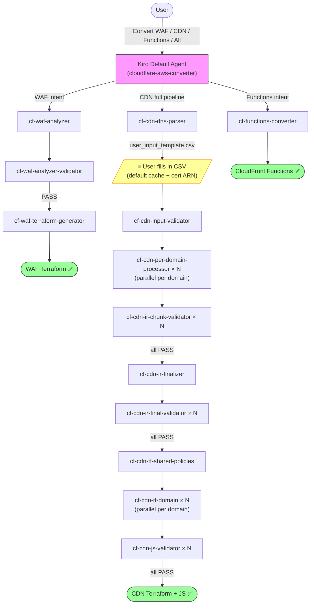

# Cloudflare to AWS Edge Migration Tool | [中文](./README_CN.md)

**Automatically convert Cloudflare configurations to AWS edge service configurations through AI conversation**

---

## ⚠️ CRITICAL: Required Input Format

**This tool ONLY works with configuration files generated by [CloudflareBackup](https://github.com/chenghit/CloudflareBackup).**

**❌ NOT COMPATIBLE with [cf-terraforming](https://github.com/cloudflare/cf-terraforming)** — cf-terraforming requires users to manually specify output file names and paths, producing unpredictable file structures that AI skills cannot reliably process. See [Why Not cf-terraforming?](./docs/why-not-cf-terraforming.md) for details.

---

## Why This Tool

Manually converting hundreds of rules when migrating from Cloudflare to AWS is time-consuming and error-prone. This tool leverages GenAI capabilities to automate batch configuration conversion through conversational interaction, reducing migration time from days to hours.

## Features

| Skill | Input | Output | Status |
|-------|-------|--------|--------|
| **cf-waf-analyzer** | Cloudflare security rules (WAF, Rate Limiting, IP Access, etc.) | Security rules summary with conversion plan | ✅ Available |
| **cf-waf-analyzer-validator** | Security rules summary | Validated summary (fixes errors in-place) | ✅ Available |
| **cf-waf-terraform-generator** | Validated security rules summary | AWS WAF configuration (Terraform) | ✅ Available |
| **cf-functions-converter** | Cloudflare transformation rules (Redirect, URL Rewrite, Header Transform, etc.) | CloudFront Functions (JavaScript) | ✅ Available |
| **cf-cdn-dns-parser** | Cloudflare DNS backup | Domain manifest + user input template CSV | ✅ Available |
| **cf-cdn-input-validator** | User-confirmed domain CSV | Validated domain scope JSON | ✅ Available |
| **cf-cdn-per-domain-processor** | Cloudflare CDN rules (all types) | CloudFront-native IR accumulator YAML per domain | ✅ Available |
| **cf-cdn-ir-chunk-validator** | IR accumulator YAML | Validation report (adversarial checker) | ✅ Available |
| **cf-cdn-ir-finalizer** | All domain IR accumulators | Sorted final IR + dedup manifest + conversion report | ✅ Available |
| **cf-cdn-ir-final-validator** | Final IR YAML | Validation report (adversarial checker) | ✅ Available |
| **cf-cdn-tf-shared-policies** | Dedup manifest | Shared Terraform policies (CachePolicy, etc.) | ✅ Available |
| **cf-cdn-tf-domain** | Final IR per domain | CloudFront Terraform + CloudFront Functions JS | ✅ Available |
| **cf-cdn-js-validator** | Generated JS functions | JS validation report (syntax + runtime constraints) | ✅ Available |

Each skill runs in a separate Kiro subagent with isolated context. The default agent loads the `cloudflare-aws-converter` orchestrator skill and automatically dispatches to the appropriate subagents.



## CDN Full Pipeline: What Happens

The CDN pipeline converts all Cloudflare CDN configurations (Cache Rules, Origin Rules, Redirect Rules, URL Rewrites, Header Transforms, Bulk Redirects, Compression Rules, Custom Error Rules, and more) into working Terraform for AWS CloudFront.

**One user interaction point:** After parsing DNS records, the tool generates a CSV template. You fill in two columns per domain — whether to apply Cloudflare's default 2-hour cache for 70+ file extensions, and optionally your ACM certificate ARN. Everything else is fully automated.

**Output structure:**
```
cloudflare-to-aws-cdn/
├── user_input_template.csv          # Fill this in, save as user_input.csv
├── dns_manifest.yaml
├── domain_scope.json
├── conversion_report.md             # Non-convertible rules + warnings
├── ir/
│   ├── accumulator/                 # Per-domain CloudFront-native IR
│   ├── final/                       # Sorted, deduplicated IR
│   └── validation/                  # Validator reports (V1, V2, V3)
└── terraform/
    ├── modules/cloudfront_distribution/
    ├── shared/
    │   ├── policies.tf              # Deduplicated CachePolicy resources
    │   └── providers.tf
    └── domains/
        └── <domain>/
            ├── main.tf
            ├── functions.tf
            ├── kvs.tf               # KVS store (if bulk redirects exist)
            ├── functions/
            │   └── viewer_request.js
            └── lambda/              # Lambda@Edge (only if CF Function too large)
```

**ACM certificates:** Add your certificate ARN in the CSV, or leave blank — the tool generates a `data "aws_acm_certificate"` lookup that finds your existing ISSUED cert automatically at `terraform plan` time.

**Design target:** Up to 50 proxied domains (matching the default CloudFront KVS quota of 50 per account). One KVS per domain, no cross-domain sharing.

## Quick Start

```bash
# 1. Install Kiro CLI
curl -fsSL https://cli.kiro.dev/install | bash

# 2. Backup Cloudflare configuration
# Use: https://github.com/chenghit/CloudflareBackup

# 3. Install skills
git clone https://github.com/chenghit/cloudflare-aws-edge-config-converter.git
cd cloudflare-aws-edge-config-converter
./install.sh

# 4. Start conversion
kiro-cli chat
```

Then just describe what you want:

```
Convert Cloudflare security rules in /path/to/cloudflare-backup to AWS WAF
Convert CDN configuration in /path/to/cloudflare-backup to CloudFront Terraform
Convert all Cloudflare configuration in /path/to/cloudflare-backup to AWS
```

For testing without your own config, use `examples/cloudflare-configs/`.

## Prerequisites

### Terraform

AWS WAF and CloudFront output requires Terraform >= 1.5.0 and AWS Provider >= 6.x.

```bash
terraform version
# Upgrade: https://developer.hashicorp.com/terraform/install
```

### Kiro CLI

- Installation: https://kiro.dev/docs/getting-started/installation/
- Skills support: Since version 1.24
- ⚠️ Kiro IDE is not recommended — it does not support `skill://` resource binding in subagents, breaking context isolation.

### Model Selection

> ⚠️ **Minimum Required Model: `claude-sonnet-4.6`**
>
> Earlier models see skill metadata but do not load the full SKILL.md body, causing tasks to fail.

- `claude-sonnet-4.6` — Recommended for WAF conversion and small CDN configs (< 10 domains)
- `claude-sonnet-4.6-1m` — Required for CDN migration with many domains (> 10) or large rule sets. Switch with `/model` in Kiro.

## Installation

```bash
git clone https://github.com/chenghit/cloudflare-aws-edge-config-converter.git
cd cloudflare-aws-edge-config-converter
./install.sh    # Copies skills to ~/.kiro/skills/, subagent configs to ~/.kiro/agents/
```

Update: `git pull && ./install.sh`

### Manual Subagent Control

For advanced users: `/agent swap <subagent-name>` to run individual pipeline stages.

Available subagents: `cf-waf-analyzer`, `cf-waf-analyzer-validator`, `cf-waf-terraform-generator`, `cf-functions-converter`, `cf-cdn-dns-parser`, `cf-cdn-input-validator`, `cf-cdn-per-domain-processor`, `cf-cdn-ir-chunk-validator`, `cf-cdn-ir-finalizer`, `cf-cdn-ir-final-validator`, `cf-cdn-tf-shared-policies`, `cf-cdn-tf-domain`, `cf-cdn-js-validator`.

## More Information

- [Best Practices](./docs/best-practices.md)
- [Limitations and Caveats](./docs/limitations.md)
- [Troubleshooting](./docs/troubleshooting.md)
- [Why Not cf-terraforming?](./docs/why-not-cf-terraforming.md)
- [Roadmap](./docs/roadmap.md)
- [Architecture Design](./docs/architecture/)

## Related Resources

- [Kiro Documentation](https://kiro.dev/docs/)
- [Agent Skills Support in Kiro CLI](https://kiro.dev/changelog/cli/1-24/)
- [AWS WAF Documentation](https://docs.aws.amazon.com/waf/)
- [CloudFront Developer Guide](https://docs.aws.amazon.com/AmazonCloudFront/latest/DeveloperGuide/)
- [CloudFront Functions Runtime 2.0](https://docs.aws.amazon.com/AmazonCloudFront/latest/DeveloperGuide/functions-javascript-runtime-20.html)

## License

[MIT](./LICENSE)

## Feedback and Contributions

For issues or suggestions, please submit an Issue or Pull Request.
