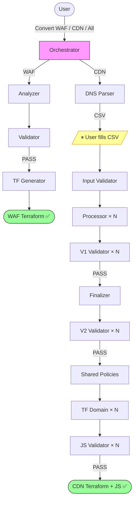

# Cloudflare to AWS Edge Migration Tool | [中文](./README_CN.md)

**Automatically convert Cloudflare configurations to AWS edge service configurations through AI conversation**

This tool reads [CloudflareBackup](https://github.com/chenghit/CloudflareBackup) exports and generates ready-to-deploy Terraform for AWS WAF and CloudFront — including cache policies, CloudFront Functions, Lambda@Edge, and KVS data.

## Quick Start

```bash
# 1. Install Kiro CLI (https://kiro.dev)
curl -fsSL https://cli.kiro.dev/install | bash

# 2. Backup your Cloudflare config
# Use: https://github.com/chenghit/CloudflareBackup

# 3. Install skills
git clone https://github.com/chenghit/cloudflare-aws-edge-config-converter.git
cd cloudflare-aws-edge-config-converter
./install.sh

# 4. Start conversion
kiro-cli chat
```

Then describe what you want:

```
Convert Cloudflare security rules in /path/to/cloudflare-backup to AWS WAF
Convert CDN configuration in /path/to/cloudflare-backup to CloudFront Terraform
Convert all Cloudflare configuration in /path/to/cloudflare-backup to AWS
```

Always provide the CloudflareBackup root directory (the one containing `account/` and zone subdirectories like `example.com/`). Do not provide a subdirectory — WAF rules reference account-level IP lists that live outside the zone directory.

For testing without your own config, use `examples/cloudflare-configs/`.

## Prerequisites

- **Kiro CLI** >= 1.24 — [Installation guide](https://kiro.dev/docs/getting-started/installation/). ⚠️ Kiro IDE is not recommended (does not support `skill://` resource binding in subagents).
- **Terraform** >= 1.8.0 with AWS Provider >= 6.x — [Install Terraform](https://developer.hashicorp.com/terraform/install). Note: `terraform validate` (run automatically after WAF generation) requires internet access on first run to download the AWS provider (~300MB).
- **Python 3** — Required by WAF pipeline helper scripts (count validation, JSON chunking). Pre-installed on macOS and most Linux distributions. No third-party packages needed (stdlib only).
- **Model**: `claude-sonnet-4.6` minimum. Use `claude-sonnet-4.6-1m` for CDN migration (per-domain processing and Terraform generation are context-heavy regardless of domain count). Switch with `/model` in Kiro.
  - **WAF migration**: `claude-sonnet-4.6` for ≤ 50 rules, `claude-sonnet-4.6-1m` for 51–100 rules, `claude-opus-4.6-1m` for > 100 rules. "Rules" = WAF Custom Rules + Rate Limiting Rules + IP Access Rules total. WAF pipeline supports up to ~200 CF rules; beyond that, consider simplifying rules in Cloudflare first or manual migration. The bottleneck for large rule sets is the Terraform generator's output — AWS WAF requires splitting Cloudflare rules that use top-level OR logic or mixed IPv4/IPv6 IP lists into multiple AWS WAF rules (e.g., a rule with 3 OR branches and mixed IPs becomes 6 AWS WAF rules). Typical split ratio is ~2x; simple zones ~1.5x, complex zones with many OR + mixed IP rules up to 3x. Each AWS WAF rule generates ~150 output tokens of HCL:
    - Sonnet 4.6 max output: 64K tokens → safe for ~200 AWS WAF rules (~100 CF rules)
    - Opus 4.6 max output: 128K tokens → safe for ~400 AWS WAF rules (~200 CF rules)
    - If your rules are mostly simple (no OR, no mixed IPs), split ratio is closer to 1x — you can stay on a lower tier
  - **CDN migration**: `claude-sonnet-4.6-1m` regardless of domain count.
- **ACM certificates** (CDN only): CloudFront requires certs in us-east-1. Provision wildcard certificates (e.g., `*.example.com`) before running, or leave blank in the CSV to let Terraform auto-discover existing ISSUED certs.
- **Input format**: Only works with [CloudflareBackup](https://github.com/chenghit/CloudflareBackup) exports. NOT compatible with [cf-terraforming](https://github.com/cloudflare/cf-terraforming) — see [Why Not cf-terraforming?](./docs/why-not-cf-terraforming.md).

## What Gets Converted

| Cloudflare | AWS Equivalent | Pipeline |
|------------|---------------|----------|
| WAF rules, Rate Limiting, IP Access | AWS WAF Web ACL (Terraform) | WAF |
| Cache Rules | CloudFront cache policies + cache behaviors | CDN |
| Origin Rules | CloudFront Functions (`updateRequestOrigin`) or cache behaviors | CDN |
| Redirect Rules | CloudFront Functions (viewer-request) | CDN |
| URL Rewrite Rules | CloudFront Functions (viewer-request) | CDN |
| Bulk Redirects | KVS + CloudFront Functions | CDN |
| Request Header Transform | CloudFront Functions + Origin Request Policy | CDN |
| Response Header Transform | Response Headers Policy + CloudFront Functions | CDN |
| Compression Rules | Cache policy `enable_gzip` / `enable_brotli` | CDN |
| Custom Error Rules | CloudFront custom error responses | CDN |
| Cloud Connector Rules | Independent cache behaviors with separate origins | CDN |

Not all Cloudflare features have CloudFront equivalents. Non-convertible items are recorded in `conversion_report.md` for manual review — never silently dropped. See [Limitations and Caveats](./docs/limitations.md) for the complete list.

## How It Works

The tool runs as a Kiro CLI skill with an orchestrator that dispatches to specialized subagents. Each subagent has isolated context and handles one pipeline stage.

**WAF pipeline** (3 stages): analyze → validate → generate Terraform

**CDN pipeline** (9 stages): parse DNS → validate user input → process rules per domain → validate IR → finalize + dedup → validate final IR → generate shared policies → generate per-domain Terraform + JS → validate JS



**One user interaction point:** After DNS parsing, you fill in a CSV template (default cache behavior + optional cert ARN per domain). Everything else is fully automated.

## CDN Pipeline Details

<details>
<summary>Output structure</summary>

```
cloudflare-to-aws-cdn/
├── user_input_template.csv          # Fill this in, save as user_input.csv
├── dns_manifest.yaml
├── domain_scope.json
├── conversion_report.md             # Non-convertible rules + warnings
├── ir/                              # Intermediate representation (debug only)
│   ├── accumulator/
│   ├── final/
│   └── validation/
└── terraform/
    ├── modules/
    │   └── cloudfront_distribution/ # Shared module (do not edit)
    ├── shared/
    │   └── policies.tf              # Deduplicated CachePolicy, ORP, RHP
    └── domains/
        └── <domain>/
            ├── main.tf              # Module call (~50-80 lines)
            ├── outputs.tf
            ├── functions.tf
            ├── kvs.tf               # Only if bulk redirects exist
            ├── functions/
            │   └── viewer_request.js
            └── lambda/              # Only if CF Function exceeds 10KB
```

</details>

<details>
<summary>Deployment order</summary>

Shared policies → Lambda@Edge (if any) → each domain independently → KVS data seeding → DNS cutover. See [Deployment Guide](./docs/deployment-guide.md) for step-by-step instructions.

</details>

<details>
<summary>Scaling and rate limits</summary>

- **Design target:** Tested with up to 50 proxied domains per zone. Larger zones should work — each subagent processes one domain in isolation.
- **Single zone per run.** Multiple zones detected → orchestrator asks you to pick one.
- **Parallel batch size: 2** (default). Conservative for Anthropic Tier 1 (50 RPM) and AWS Bedrock default quotas. Increase by editing `cloudflare-aws-converter/SKILL.md` if your quota allows. Tier 2+ or Bedrock with approved increase can use batch size 4 (Kiro CLI max).
- **KVS quota:** Default 50 per account (soft limit). [Request increase](https://docs.aws.amazon.com/servicequotas/latest/userguide/request-quota-increase.html) if > 50 domains use bulk redirects.

</details>

<details>
<summary>ACM certificates</summary>

CloudFront requires TLS certificates in **us-east-1**. Provision before running:

```bash
aws acm request-certificate \
  --domain-name "*.example.com" \
  --validation-method DNS \
  --region us-east-1
```

Or leave the cert ARN blank in the CSV — the tool generates a `data "aws_acm_certificate"` lookup that finds your existing ISSUED cert at `terraform plan` time.

</details>

<details>
<summary>What the tool does NOT configure</summary>

- **CloudFront access logging** — involves S3 bucket decisions outside migration scope. Add `logging_config` to `main.tf` if needed.
- **Lambda@Edge deployment** — code is generated but ARN placeholders must be filled after deploying. See [Deployment Guide](./docs/deployment-guide.md).
- **DNS cutover** — distributions are created but DNS records are not modified.

</details>

## Installation

```bash
git clone https://github.com/chenghit/cloudflare-aws-edge-config-converter.git
cd cloudflare-aws-edge-config-converter
./install.sh    # Copies skills to ~/.kiro/skills/, subagent configs to ~/.kiro/agents/
```

Update: `git pull && ./install.sh`

> **Using a different agent tool?** The install scripts and all SKILL.md files use `~/.kiro/skills/` as the default skill directory (Kiro CLI convention). To use these skills with another agent tool, you need to: (1) modify `install.sh` / `uninstall.sh` to point to your tool's skill directory, and (2) find-and-replace `~/.kiro/skills/` with your tool's skill path across all SKILL.md files — subagents reference each other by absolute installed path.

For advanced users: `/agent swap <subagent-name>` to run individual pipeline stages. Available subagents: `cf-waf-analyzer`, `cf-waf-analyzer-validator`, `cf-waf-terraform-generator`, `cf-waf-summary-scanner`, `cf-cdn-dns-parser`, `cf-cdn-input-validator`, `cf-cdn-per-domain-processor`, `cf-cdn-ir-chunk-validator`, `cf-cdn-ir-finalizer`, `cf-cdn-ir-final-validator`, `cf-cdn-tf-shared-policies`, `cf-cdn-tf-domain`, `cf-cdn-js-validator`.

## Subagent Permissions and Security

Most subagents only have file I/O and search permissions (`fs_read`, `fs_write`, `glob`, `grep`). One subagent requires shell execution:

| Subagent | Has `execute_bash` | Why |
|----------|-------------------|-----|
| `cf-cdn-js-validator` | ✅ Yes | Runs `node --check <file>` for JavaScript syntax validation and `wc -c` for file size checks. These are the only two commands it needs — there is no way to validate JS syntax or measure byte-accurate file size with file I/O tools alone. |
| All other subagents | ❌ No | Only need to read/write files and search text. |

**If your security policy flags `execute_bash`:** You can review the validator's SKILL.md to confirm it only runs `node --check` and `wc -c`. Removing `execute_bash` from `cf-cdn-js-validator.json` will disable JS syntax checking (CFF-01, LE-01) and byte-accurate size validation (CFF-06, LE-03) — the validator will skip these checks and report them as `SKIP` in the output JSON.

**Do not use manual approval as a workaround.** Subagents run inside the orchestrator's context — when the main agent dispatches a task to a subagent, you do not see individual tool calls from that subagent in your chat. Manual approval per-call is not possible for subagent tool invocations, so removing the permission and relying on interactive approval is not a viable alternative.

## More Information

- [Best Practices](./docs/best-practices.md)
- [Deployment Guide](./docs/deployment-guide.md)
- [Limitations and Caveats](./docs/limitations.md)
- [Troubleshooting](./docs/troubleshooting.md)
- [Why Not cf-terraforming?](./docs/why-not-cf-terraforming.md)

## Related Resources

- [Kiro Documentation](https://kiro.dev/docs/)
- [Agent Skills Support in Kiro CLI](https://kiro.dev/changelog/cli/1-24/)
- [AWS WAF Documentation](https://docs.aws.amazon.com/waf/)
- [CloudFront Developer Guide](https://docs.aws.amazon.com/AmazonCloudFront/latest/DeveloperGuide/)
- [CloudFront Functions Runtime 2.0](https://docs.aws.amazon.com/AmazonCloudFront/latest/DeveloperGuide/functions-javascript-runtime-20.html)

## License

[MIT](./LICENSE)

## Feedback and Contributions

For issues or suggestions, please submit an Issue or Pull Request.
