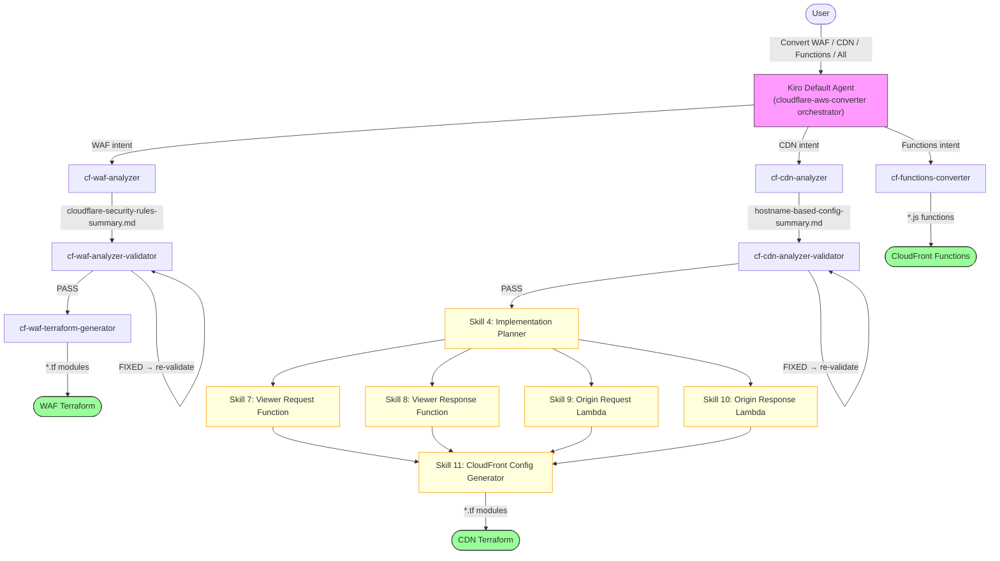

# Cloudflare to AWS Edge Migration Tool | [中文](./README_CN.md)

**Automatically convert Cloudflare configurations to AWS edge service configurations through AI conversation**

---

## ⚠️ CRITICAL: Required Input Format

**This tool ONLY works with configuration files generated by [CloudflareBackup](https://github.com/chenghit/CloudflareBackup).**

**❌ NOT COMPATIBLE with [cf-terraforming](https://github.com/cloudflare/cf-terraforming)** — cf-terraforming requires users to manually specify output file names and paths, producing unpredictable file structures that AI skills cannot reliably process. See [Why Not cf-terraforming?](./docs/why-not-cf-terraforming.md) for details.

---

## Why This Tool

Manually converting hundreds of rules when migrating from Cloudflare to AWS is time-consuming and error-prone. This tool leverages GenAI capabilities to automate batch configuration conversion through conversational interaction, reducing migration time from days to hours.

## Features

| Skill | Input | Output | Status |
|-------|-------|--------|--------|
| **cf-waf-analyzer** | Cloudflare security rules (WAF, Rate Limiting, IP Access, etc.) | Security rules summary with conversion plan | ✅ Available |
| **cf-waf-analyzer-validator** | Security rules summary | Validated summary (fixes errors in-place) | ✅ Available |
| **cf-waf-terraform-generator** | Validated security rules summary | AWS WAF configuration (Terraform) | ✅ Available |
| **cf-functions-converter** | Cloudflare transformation rules (Redirect, URL Rewrite, Header Transform, etc.) | CloudFront Functions (JavaScript) | ✅ Available |
| **cf-cdn-analyzer** | Cloudflare CDN configuration (Cache, Origin, Redirect, etc.) | Hostname-based configuration summary | ✅ Available |
| **cf-cdn-analyzer-validator** | Hostname-based configuration summary | Validated summary (fixes errors in-place) | ✅ Available |

Each skill runs in a separate Kiro subagent with isolated context. The default agent loads the `cloudflare-aws-converter` orchestrator skill and automatically dispatches to the appropriate subagents. You don't need to understand this architecture — just describe what you want and Kiro handles the rest.



## Quick Start

```bash
# 1. Install Kiro CLI
curl -fsSL https://cli.kiro.dev/install | bash

# 2. Backup Cloudflare configuration
# Use: https://github.com/chenghit/CloudflareBackup

# 3. Install skills
git clone https://github.com/chenghit/cloudflare-aws-edge-config-converter.git
cd cloudflare-aws-edge-config-converter
./install.sh

# 4. Start conversion
kiro-cli chat
```

Then just describe what you want:

```
Convert Cloudflare security rules in /path/to/cloudflare-backup to AWS WAF
Convert transformation rules in /path/to/cloudflare-backup to CloudFront Functions
Analyze CDN configuration in /path/to/cloudflare-backup
Convert all Cloudflare configuration in /path/to/cloudflare-backup to AWS
```

Kiro automatically invokes the appropriate subagents. No `/agent swap` needed.

For testing without your own config, use `examples/cloudflare-configs/`.

Complete conversation examples: [examples/conversation-history/](examples/conversation-history/)

## Prerequisites

### Terraform

AWS WAF output requires Terraform >= 1.8.0 (AWS Provider 6.x dependency).

```bash
terraform version
# Upgrade: https://developer.hashicorp.com/terraform/install
```

### Kiro CLI

- Installation: https://kiro.dev/docs/getting-started/installation/
- Skills support: Since version 1.24
- ⚠️ Kiro IDE is not recommended — it does not support `skill://` resource binding in subagents, breaking context isolation.

### Model Selection

> ⚠️ **Minimum Required Model: `claude-sonnet-4.6`**
>
> Earlier models see skill metadata but do not load the full SKILL.md body, causing tasks to fail.

- `claude-sonnet-4.6` — Recommended for < 100 rules
- `claude-sonnet-4.6-1m` — For > 100 rules or CDN migration with many domains. Switch with `/model` in Kiro.

## Installation

```bash
git clone https://github.com/chenghit/cloudflare-aws-edge-config-converter.git
cd cloudflare-aws-edge-config-converter
./install.sh    # Copies skills to ~/.kiro/skills/, subagent configs to ~/.kiro/agents/
```

Update: `git pull && ./install.sh`

### Manual Subagent Control

For advanced users: `/agent swap <subagent-name>` to run individual stages. Available: `cf-waf-analyzer`, `cf-waf-analyzer-validator`, `cf-waf-terraform-generator`, `cf-functions-converter`, `cf-cdn-analyzer`, `cf-cdn-analyzer-validator`.

## More Information

- [Best Practices](./docs/best-practices.md)
- [Limitations and Caveats](./docs/limitations.md)
- [Troubleshooting](./docs/troubleshooting.md)
- [Why Not cf-terraforming?](./docs/why-not-cf-terraforming.md)
- [Roadmap](./docs/roadmap.md)
- [Architecture Design](./docs/architecture/)

## Related Resources

- [Kiro Documentation](https://kiro.dev/docs/)
- [Agent Skills Support in Kiro CLI](https://kiro.dev/changelog/cli/1-24/)
- [AWS WAF Documentation](https://docs.aws.amazon.com/waf/)
- [CloudFront Functions Documentation](https://docs.aws.amazon.com/AmazonCloudFront/latest/DeveloperGuide/cloudfront-functions.html)

## License

[MIT](./LICENSE)

## Feedback and Contributions

For issues or suggestions, please submit an Issue or Pull Request.
