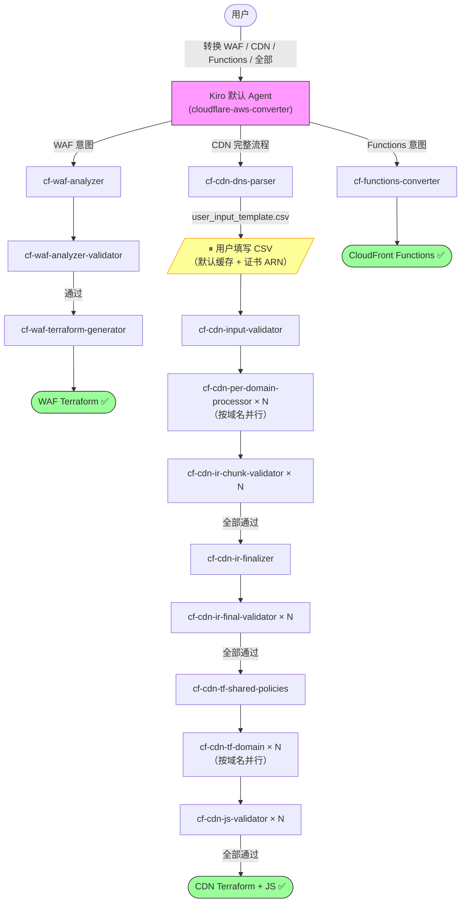

# Cloudflare 到 AWS 边缘服务迁移工具 | [English](./README.md)

**通过 AI 对话，自动将 Cloudflare 配置转换为 AWS 边缘服务配置**

---

## ⚠️ 重要：输入格式要求

**本工具仅支持由 [CloudflareBackup](https://github.com/chenghit/CloudflareBackup) 生成的配置备份文件。**

**❌ 不兼容 [cf-terraforming](https://github.com/cloudflare/cf-terraforming)** — cf-terraforming 需要用户手动指定输出文件名和路径，生成不可预测的文件结构，AI skills 无法可靠处理。详见 [为何不用 cf-terraforming？](./docs/why-not-cf-terraforming.md)

---

## 为什么使用这个工具

从 Cloudflare 迁移到 AWS 时，手动转换数百条规则既费时又容易出错。本工具借助 GenAI 能力，通过对话式交互实现批量配置转换自动化，将迁移时间从几天缩短到几小时。

## 功能列表

| Skill | 输入 | 输出 | 状态 |
|-------|------|------|------|
| **cf-waf-analyzer** | Cloudflare 安全规则（WAF、速率限制、IP 访问控制等） | 安全规则摘要及转换计划 | ✅ 可用 |
| **cf-waf-analyzer-validator** | 安全规则摘要 | 已校验摘要（就地修复错误） | ✅ 可用 |
| **cf-waf-terraform-generator** | 已校验安全规则摘要 | AWS WAF 配置（Terraform） | ✅ 可用 |
| **cf-functions-converter** | Cloudflare 转换规则（重定向、URL 重写、请求头转换等） | CloudFront Functions（JavaScript） | ✅ 可用 |
| **cf-cdn-dns-parser** | Cloudflare DNS 备份 | 域名清单 + 用户输入模板 CSV | ✅ 可用 |
| **cf-cdn-input-validator** | 用户确认后的域名 CSV | 已验证的域名范围 JSON | ✅ 可用 |
| **cf-cdn-per-domain-processor** | Cloudflare CDN 所有规则类型 | 每域名 CloudFront 原生 IR YAML | ✅ 可用 |
| **cf-cdn-ir-chunk-validator** | IR accumulator YAML | 验证报告（对抗性检查器） | ✅ 可用 |
| **cf-cdn-ir-finalizer** | 所有域名 IR | 排序后的最终 IR + 去重清单 + 转换报告 | ✅ 可用 |
| **cf-cdn-ir-final-validator** | 最终 IR YAML | 验证报告（对抗性检查器） | ✅ 可用 |
| **cf-cdn-tf-shared-policies** | 去重清单 | 共享 Terraform 策略（CachePolicy 等） | ✅ 可用 |
| **cf-cdn-tf-domain** | 每域名最终 IR | CloudFront Terraform + CloudFront Functions JS | ✅ 可用 |
| **cf-cdn-js-validator** | 生成的 JS 函数文件 | JS 验证报告（语法 + 运行时约束） | ✅ 可用 |

每个 skill 在独立的 Kiro subagent 中运行，拥有隔离的上下文。默认 agent 加载 `cloudflare-aws-converter` 编排 skill，自动调度到相应的 subagent。



## CDN 完整流程：工作原理

CDN 流程将所有 Cloudflare CDN 配置（缓存规则、源站规则、重定向规则、URL 重写、请求头转换、批量重定向、压缩规则、自定义错误规则等）转换为可直接使用的 AWS CloudFront Terraform 文件。

**唯一的用户交互点：** 解析 DNS 记录后，工具生成一个 CSV 模板。你只需填写两列内容——是否为每个域名应用 Cloudflare 默认的 70+ 文件类型 2 小时缓存策略，以及可选的 ACM 证书 ARN。其余步骤完全自动化。

**输出目录结构：**
```
cloudflare-to-aws-cdn/
├── user_input_template.csv          # 填写后另存为 user_input.csv
├── dns_manifest.yaml
├── domain_scope.json
├── conversion_report.md             # 不可转换规则 + 警告信息
├── ir/
│   ├── accumulator/                 # 每域名 CloudFront 原生中间表示
│   ├── final/                       # 排序并去重后的中间表示
│   └── validation/                  # 验证报告（V1、V2、V3）
└── terraform/
    ├── modules/cloudfront_distribution/
    ├── shared/
    │   ├── policies.tf              # 去重后的 CachePolicy 资源
    │   └── providers.tf
    └── domains/
        └── <域名>/
            ├── main.tf
            ├── functions.tf
            ├── kvs.tf               # KVS 存储（如有批量重定向）
            ├── functions/
            │   └── viewer_request.js
            └── lambda/              # Lambda@Edge（仅当 CF Function 超过大小限制时）
```

**ACM 证书：** 在 CSV 中填入证书 ARN，或留空——工具会生成 `data "aws_acm_certificate"` 数据源，在 `terraform plan` 时自动查找你已有的 ISSUED 证书。

**设计目标：** 最多支持 50 个代理域名（对应 CloudFront KVS 默认配额 50 个/账号）。每个域名一个独立 KVS，不跨域共享。

## 快速开始

```bash
# 1. 安装 Kiro CLI
curl -fsSL https://cli.kiro.dev/install | bash

# 2. 备份 Cloudflare 配置
# 使用：https://github.com/chenghit/CloudflareBackup

# 3. 安装 skills
git clone https://github.com/chenghit/cloudflare-aws-edge-config-converter.git
cd cloudflare-aws-edge-config-converter
./install.sh

# 4. 开始转换
kiro-cli chat
```

然后描述你的需求：

```
将 /path/to/cloudflare-backup 中的 Cloudflare 安全规则转换为 AWS WAF
将 /path/to/cloudflare-backup 中的 CDN 配置转换为 CloudFront Terraform
将 /path/to/cloudflare-backup 中的全部 Cloudflare 配置转换到 AWS
```

如需在没有自己配置的情况下测试，可使用 `examples/cloudflare-configs/`。

## 前提条件

### Terraform

AWS WAF 和 CloudFront 输出需要 Terraform >= 1.5.0、AWS Provider >= 6.x。

```bash
terraform version
# 升级：https://developer.hashicorp.com/terraform/install
```

### Kiro CLI

- 安装文档：https://kiro.dev/docs/getting-started/installation/
- Skills 支持：自 1.24 版本起
- ⚠️ 不推荐使用 Kiro IDE——它不支持 subagent 中的 `skill://` 资源绑定，会破坏上下文隔离。

### 模型选择

> ⚠️ **最低要求模型：`claude-sonnet-4.6`**
>
> 旧版模型只能看到 skill 元数据，无法加载完整的 SKILL.md 内容，导致任务失败。

- `claude-sonnet-4.6` — 推荐用于 WAF 转换及小型 CDN 配置（< 10 个域名）
- `claude-sonnet-4.6-1m` — CDN 迁移域名较多（> 10 个）或规则量大时必须使用。在 Kiro 中通过 `/model` 切换。

## 安装

```bash
git clone https://github.com/chenghit/cloudflare-aws-edge-config-converter.git
cd cloudflare-aws-edge-config-converter
./install.sh    # 将 skills 复制到 ~/.kiro/skills/，subagent 配置复制到 ~/.kiro/agents/
```

更新：`git pull && ./install.sh`

### 手动控制 Subagent

高级用户可通过 `/agent swap <subagent-name>` 单独运行各流程阶段。

可用 subagent：`cf-waf-analyzer`、`cf-waf-analyzer-validator`、`cf-waf-terraform-generator`、`cf-functions-converter`、`cf-cdn-dns-parser`、`cf-cdn-input-validator`、`cf-cdn-per-domain-processor`、`cf-cdn-ir-chunk-validator`、`cf-cdn-ir-finalizer`、`cf-cdn-ir-final-validator`、`cf-cdn-tf-shared-policies`、`cf-cdn-tf-domain`、`cf-cdn-js-validator`。

## 更多信息

- [最佳实践](./docs/best-practices.md)
- [限制与注意事项](./docs/limitations.md)
- [故障排除](./docs/troubleshooting.md)
- [为何不用 cf-terraforming？](./docs/why-not-cf-terraforming.md)
- [路线图](./docs/roadmap.md)
- [架构设计](./docs/architecture/)

## 相关资源

- [Kiro 文档](https://kiro.dev/docs/)
- [Kiro CLI Agent Skills 支持](https://kiro.dev/changelog/cli/1-24/)
- [AWS WAF 文档](https://docs.aws.amazon.com/waf/)
- [CloudFront 开发者指南](https://docs.aws.amazon.com/AmazonCloudFront/latest/DeveloperGuide/)
- [CloudFront Functions Runtime 2.0](https://docs.aws.amazon.com/AmazonCloudFront/latest/DeveloperGuide/functions-javascript-runtime-20.html)

## 许可证

[MIT](./LICENSE)

## 反馈与贡献

如有问题或建议，欢迎提交 Issue 或 Pull Request。
