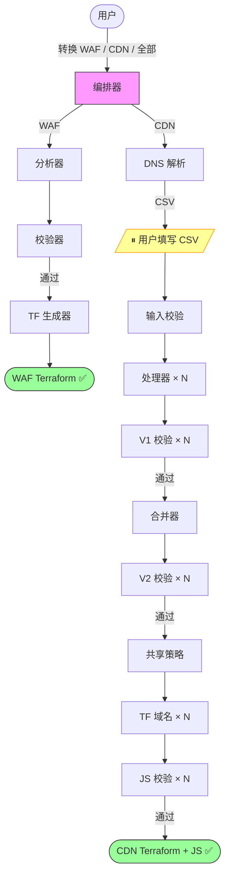

# Cloudflare 到 AWS 边缘服务迁移工具 | [English](./README.md)

**通过 AI 对话，自动将 Cloudflare 配置转换为 AWS 边缘服务配置**

本工具读取 [CloudflareBackup](https://github.com/chenghit/CloudflareBackup) 导出的备份文件，生成可直接部署的 AWS WAF 和 CloudFront Terraform 配置——包括缓存策略、CloudFront Functions、Lambda@Edge 和 KVS 数据。

## 快速开始

```bash
# 1. 安装 Kiro CLI（https://kiro.dev）
curl -fsSL https://cli.kiro.dev/install | bash

# 2. 备份 Cloudflare 配置
# 使用：https://github.com/chenghit/CloudflareBackup

# 3. 安装 skills
git clone https://github.com/chenghit/cloudflare-aws-edge-config-converter.git
cd cloudflare-aws-edge-config-converter
./install.sh

# 4. 开始转换
kiro-cli chat
```

然后描述你的需求：

```
将 /path/to/cloudflare-backup 中的 Cloudflare 安全规则转换为 AWS WAF
将 /path/to/cloudflare-backup 中的 CDN 配置转换为 CloudFront Terraform
将 /path/to/cloudflare-backup 中的全部 Cloudflare 配置转换到 AWS
```

如需在没有自己配置的情况下测试，可使用 `examples/cloudflare-configs/`。

## 前提条件

- **Kiro CLI** >= 1.24 — [安装文档](https://kiro.dev/docs/getting-started/installation/)。⚠️ 不推荐使用 Kiro IDE（不支持 subagent 中的 `skill://` 资源绑定）。
- **Terraform** >= 1.8.0，AWS Provider >= 6.x — [安装 Terraform](https://developer.hashicorp.com/terraform/install)
- **模型**：最低 `claude-sonnet-4.6`。CDN 迁移推荐使用 `claude-sonnet-4.6-1m`（每域名处理和 Terraform 生成的 context 消耗较大，与域名数量无关）。在 Kiro 中通过 `/model` 切换。
  - **WAF 迁移**：≤ 50 条规则用 `claude-sonnet-4.6`，51–100 条用 `claude-sonnet-4.6-1m`，> 100 条用 `claude-opus-4.6-1m`。"规则"= WAF Custom Rules + Rate Limiting Rules + IP Access Rules 总数。复杂规则（多 OR 分支 + 混合 IPv4/IPv6）可能需要降一档选模型。WAF pipeline 最多支持约 200 条 CF 规则；超过此数建议先在 Cloudflare 端简化规则或手动迁移。瓶颈在于 Terraform generator 的输出量——每条 CF 规则 split 后约产生 2 条 AWS WAF 规则，每条约 150 output tokens 的 HCL：
    - Sonnet 4.6 最大输出：64K tokens → 约 200 条 AWS WAF 规则（约 100 条 CF 规则）
    - Opus 4.6 最大输出：128K tokens → 约 400 条 AWS WAF 规则（约 200 条 CF 规则）
  - **CDN 迁移**：无论域名数量，统一使用 `claude-sonnet-4.6-1m`。
- **ACM 证书**（仅 CDN）：CloudFront 要求证书位于 us-east-1。运行前申请通配符证书（如 `*.example.com`），或在 CSV 中留空让 Terraform 自动查找已签发的证书。
- **输入格式**：仅支持 [CloudflareBackup](https://github.com/chenghit/CloudflareBackup) 导出。不兼容 [cf-terraforming](https://github.com/cloudflare/cf-terraforming)——详见 [为何不用 cf-terraforming？](./docs/why-not-cf-terraforming.md)

## 转换范围

| Cloudflare | AWS 等价物 | 流程 |
|------------|-----------|------|
| WAF 规则、速率限制、IP 访问控制 | AWS WAF Web ACL (Terraform) | WAF |
| 缓存规则 | CloudFront 缓存策略 + 缓存行为 | CDN |
| 源站规则 | CloudFront Functions (`updateRequestOrigin`) 或缓存行为 | CDN |
| 重定向规则 | CloudFront Functions (viewer-request) | CDN |
| URL 重写规则 | CloudFront Functions (viewer-request) | CDN |
| 批量重定向 | KVS + CloudFront Functions | CDN |
| 请求头转换 | CloudFront Functions + Origin Request Policy | CDN |
| 响应头转换 | Response Headers Policy + CloudFront Functions | CDN |
| 压缩规则 | 缓存策略 `enable_gzip` / `enable_brotli` | CDN |
| 自定义错误规则 | CloudFront 自定义错误响应 | CDN |
| Cloud Connector 规则 | 独立缓存行为 + 独立源站 | CDN |

并非所有 Cloudflare 功能都有 CloudFront 等价物。无法转换的项目会记录在 `conversion_report.md` 中供人工审查——不会被静默丢弃。完整列表见 [限制与注意事项](./docs/limitations.md)。

## 工作原理

本工具作为 Kiro CLI skill 运行，由编排器调度专用 subagent。每个 subagent 拥有隔离的上下文，负责一个流程阶段。

**WAF 流程**（3 阶段）：分析 → 校验 → 生成 Terraform

**CDN 流程**（9 阶段）：解析 DNS → 校验用户输入 → 按域名处理规则 → 校验 IR → 合并去重 → 校验最终 IR → 生成共享策略 → 生成每域名 Terraform + JS → 校验 JS



**唯一的用户交互点：** 解析 DNS 后，你填写一个 CSV 模板（每域名的默认缓存行为 + 可选证书 ARN）。其余步骤完全自动化。

## CDN 流程详情

<details>
<summary>输出目录结构</summary>

```
cloudflare-to-aws-cdn/
├── user_input_template.csv          # 填写后另存为 user_input.csv
├── dns_manifest.yaml
├── domain_scope.json
├── conversion_report.md             # 不可转换规则 + 警告
├── ir/                              # 中间表示（仅调试用）
│   ├── accumulator/
│   ├── final/
│   └── validation/
└── terraform/
    ├── modules/
    │   └── cloudfront_distribution/ # 共享模块（勿编辑）
    ├── shared/
    │   └── policies.tf              # 去重后的 CachePolicy、ORP、RHP
    └── domains/
        └── <域名>/
            ├── main.tf              # Module call（约 50-80 行）
            ├── outputs.tf
            ├── functions.tf
            ├── kvs.tf               # 仅当有批量重定向时
            ├── functions/
            │   └── viewer_request.js
            └── lambda/              # 仅当 CF Function 超过 10KB 时
```

</details>

<details>
<summary>部署顺序</summary>

共享策略 → Lambda@Edge（如有）→ 各域名独立部署 → KVS 数据导入 → DNS 切换。详见 [部署指南](./docs/deployment-guide.md)。

</details>

<details>
<summary>扩展性与限速</summary>

- **设计目标：** 已测试最多 50 个代理域名。更大的 zone 也应该可以工作——每个 subagent 独立处理一个域名。
- **单 zone 运行。** 检测到多个 zone → 编排器要求你选择一个。
- **并行批次大小：2**（默认）。适合 Anthropic Tier 1（50 RPM）和 AWS Bedrock 默认配额。如配额更高，可编辑 `cloudflare-aws-converter/SKILL.md` 增加。Tier 2+ 或 Bedrock 已提额可用批次大小 4（Kiro CLI 最大值）。
- **KVS 配额：** 默认 50 个/账号（软限制）。如 > 50 个域名使用批量重定向，请[申请提额](https://docs.aws.amazon.com/servicequotas/latest/userguide/request-quota-increase.html)。

</details>

<details>
<summary>ACM 证书</summary>

CloudFront 要求 TLS 证书位于 **us-east-1**。运行前申请：

```bash
aws acm request-certificate \
  --domain-name "*.example.com" \
  --validation-method DNS \
  --region us-east-1
```

或在 CSV 中留空——工具会生成 `data "aws_acm_certificate"` 数据源，在 `terraform plan` 时自动查找已签发的证书。

</details>

<details>
<summary>本工具不配置的内容</summary>

- **CloudFront 访问日志** — 涉及 S3 桶决策，超出迁移范围。如需要，自行在 `main.tf` 中添加 `logging_config`。
- **Lambda@Edge 部署** — 代码已生成，但 ARN 占位符需在部署后填入。详见 [部署指南](./docs/deployment-guide.md)。
- **DNS 切换** — 创建了 distribution 但不修改 DNS 记录。

</details>

## 安装

```bash
git clone https://github.com/chenghit/cloudflare-aws-edge-config-converter.git
cd cloudflare-aws-edge-config-converter
./install.sh    # 将 skills 复制到 ~/.kiro/skills/，subagent 配置复制到 ~/.kiro/agents/
```

更新：`git pull && ./install.sh`

> **使用其他 Agent 工具？** 安装脚本和所有 SKILL.md 文件默认使用 `~/.kiro/skills/` 作为 skill 安装目录（Kiro CLI 约定）。如需配合其他 agent 工具使用，需要：(1) 修改 `install.sh` / `uninstall.sh` 中的目标目录；(2) 在所有 SKILL.md 文件中将 `~/.kiro/skills/` 全局替换为你的 agent 工具的 skill 路径——subagent 之间通过绝对安装路径互相引用。

高级用户可通过 `/agent swap <subagent-name>` 单独运行各流程阶段。可用 subagent：`cf-waf-analyzer`、`cf-waf-analyzer-validator`、`cf-waf-terraform-generator`、`cf-waf-summary-scanner`、`cf-cdn-dns-parser`、`cf-cdn-input-validator`、`cf-cdn-per-domain-processor`、`cf-cdn-ir-chunk-validator`、`cf-cdn-ir-finalizer`、`cf-cdn-ir-final-validator`、`cf-cdn-tf-shared-policies`、`cf-cdn-tf-domain`、`cf-cdn-js-validator`。

## Subagent 权限与安全

大多数 subagent 只有文件读写和搜索权限（`fs_read`、`fs_write`、`glob`、`grep`）。只有一个 subagent 需要 shell 执行权限：

| Subagent | 有 `execute_bash` | 原因 |
|----------|-------------------|------|
| `cf-cdn-js-validator` | ✅ 有 | 运行 `node --check <file>` 做 JavaScript 语法检查，以及 `wc -c` 做文件大小检查。这是它唯一需要的两个命令——仅靠文件读写工具无法完成 JS 语法校验和精确的字节大小测量。 |
| 其他所有 subagent | ❌ 无 | 只需要读写文件和搜索文本。 |

**如果你的安全策略对 `execute_bash` 有告警：** 你可以查看该 validator 的 SKILL.md 确认它只运行 `node --check` 和 `wc -c`。从 `cf-cdn-js-validator.json` 中移除 `execute_bash` 会导致 JS 语法检查（CFF-01、LE-01）和精确文件大小校验（CFF-06、LE-03）被禁用——validator 会跳过这些检查并在输出 JSON 中标记为 `SKIP`。

**不要尝试用手动审批来替代。** Subagent 运行在编排器的上下文中——当主 agent 将任务分派给 subagent 时，你在聊天界面中看不到该 subagent 的具体工具调用。对 subagent 的工具调用无法逐个手动审批，因此移除权限后依赖交互式审批并不可行。

## 更多信息

- [最佳实践](./docs/best-practices_CN.md)
- [部署指南](./docs/deployment-guide_CN.md)
- [限制与注意事项](./docs/limitations_CN.md)
- [故障排除](./docs/troubleshooting_CN.md)
- [为何不用 cf-terraforming？](./docs/why-not-cf-terraforming_CN.md)

## 相关资源

- [Kiro 文档](https://kiro.dev/docs/)
- [Kiro CLI Agent Skills 支持](https://kiro.dev/changelog/cli/1-24/)
- [AWS WAF 文档](https://docs.aws.amazon.com/waf/)
- [CloudFront 开发者指南](https://docs.aws.amazon.com/AmazonCloudFront/latest/DeveloperGuide/)
- [CloudFront Functions Runtime 2.0](https://docs.aws.amazon.com/AmazonCloudFront/latest/DeveloperGuide/functions-javascript-runtime-20.html)

## 许可证

[MIT](./LICENSE)

## 反馈与贡献

如有问题或建议，欢迎提交 Issue 或 Pull Request。
