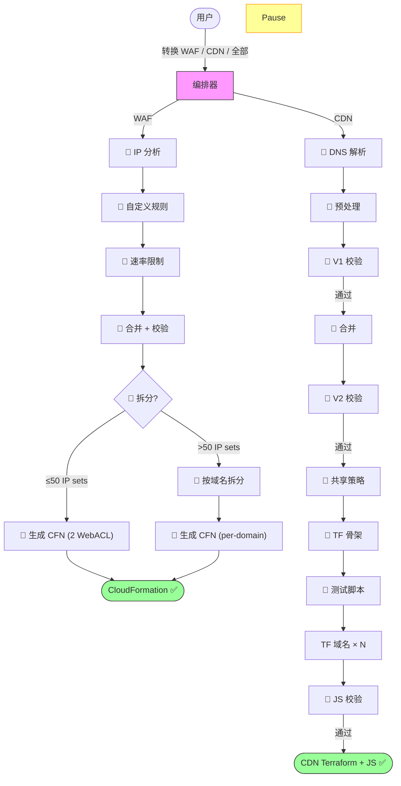

# Cloudflare 到 AWS 边缘服务迁移工具 | [English](./README.md)

**通过 AI 对话，自动将 Cloudflare 配置转换为 AWS 边缘服务配置**

本工具读取 [CloudflareBackup](https://github.com/chenghit/CloudflareBackup) 导出的备份文件，生成可直接部署的 AWS WAF（CloudFormation）和 CloudFront（Terraform）配置——包括缓存策略、CloudFront Functions、Lambda@Edge 和 KVS 数据。

> **⚠️ Kiro CLI 1.28.0 与本工具不兼容。** 1.28.0 版本（2026-03-20 发布）存在两个导致 subagent pipeline 无法运行的 bug：shell 审批阻塞（[#4751](https://github.com/kirodotdev/Kiro/issues/4751)）和 subagent 结果返回失败（[#6163](https://github.com/kirodotdev/Kiro/issues/6163)）。两个 bug 均已在 **1.28.1** 中修复。如果你使用的是 1.28.0，请升级：
> ```bash
> curl -fsSL https://cli.kiro.dev/install | bash
> ```
> Kiro CLI 1.24–1.27 和 1.28.1+ 均可正常使用。

## 快速开始

```bash
# 1. 安装 Kiro CLI（https://kiro.dev）
curl -fsSL https://cli.kiro.dev/install | bash

# 2. 备份 Cloudflare 配置
# 使用：https://github.com/chenghit/CloudflareBackup

# 3. 安装 skills
git clone https://github.com/chenghit/cloudflare-aws-edge-config-converter.git
cd cloudflare-aws-edge-config-converter
./install.sh

# 4. 开始转换
kiro-cli chat
```

然后描述你的需求：

```
将 /path/to/cloudflare-backup 中的 Cloudflare 安全规则转换为 AWS WAF
将 /path/to/cloudflare-backup 中的 CDN 配置转换为 CloudFront Terraform
将 /path/to/cloudflare-backup 中的全部 Cloudflare 配置转换到 AWS
```

请始终提供 **CloudflareBackup 的根目录**（包含 `account/` 和 zone 子目录如 `example.com/` 的那个目录）。**不要**提供子目录——WAF 和 CDN pipeline 都需要 `account/` 目录中的文件（WAF 需要 IP 列表，CDN 需要 bulk redirect 列表），这些文件位于 zone 目录之外。

如需在没有自己配置的情况下测试，可使用 `examples/cloudflare-configs/`。

## 前提条件

- **Kiro CLI** >= 1.24 — [安装文档](https://kiro.dev/docs/getting-started/installation/)。⚠️ 不推荐使用 Kiro IDE（不支持 subagent 中的 `skill://` 资源绑定）。**避免使用 Kiro CLI 1.28.0** — 该版本有两个 bug（[#4751](https://github.com/kirodotdev/Kiro/issues/4751)、[#6163](https://github.com/kirodotdev/Kiro/issues/6163)）会导致 subagent pipeline 无法运行，已在 1.28.1 中修复。**Kiro CLI 1.29.x** 存在回归 bug：未显式指定 `model` 字段的 subagent 会报 `Missing modelId` 错误（[#7321](https://github.com/kirodotdev/Kiro/issues/7321)）。临时解决方案：在 `~/.kiro/agents/` 下的每个 agent 配置中添加 `"model": "claude-sonnet-4.6"`。
- **Terraform** >= 1.8.0，AWS Provider >= 6.x — [安装 Terraform](https://developer.hashicorp.com/terraform/install)。仅 CDN pipeline 需要。WAF pipeline 使用 CloudFormation（不需要 Terraform）。
- **Python 3** — WAF 和 CDN pipeline 的脚本都需要。WAF pipeline 完全基于 Python（表达式解析、分析、验证、CloudFormation 生成）。CDN 用 Python 做规则预处理、IR 校验和合并（Stage 3–7.6）。macOS 和大多数 Linux 发行版已预装。转换流程无需第三方包（仅用标准库）。**部署阶段**：有 KVS 的 CDN 域名（批量重定向、IP 列表、错误页面）会生成 `seed-kvs.py` 脚本，需要 `boto3`——部署前运行 `pip install boto3` 安装。
- **模型**：转换 pipeline 本身无模型要求——所有脚本都是确定性 Python，零 LLM 调用。Kiro CLI 支持的任何模型都可以，编排器只需要理解用户意图、运行 shell 命令，以及为非英文用户翻译部署文档。
- **ACM 证书**（仅 CDN）：CloudFront 要求证书位于 us-east-1。运行前申请通配符证书（如 `*.example.com`），Terraform 会自动查找已签发的证书。
- **输入格式**：仅支持 [CloudflareBackup](https://github.com/chenghit/CloudflareBackup) 导出。不兼容 [cf-terraforming](https://github.com/cloudflare/cf-terraforming)——详见 [为何不用 cf-terraforming？](./docs/why-not-cf-terraforming.md)

## 转换范围

| Cloudflare | AWS 等价物 | 流程 |
|------------|-----------|------|
| WAF 规则、速率限制、IP 访问控制 | AWS WAF Web ACL (CloudFormation) | WAF |
| 缓存规则 | CloudFront 缓存策略 + 缓存行为 | CDN |
| 源站规则 | CloudFront Functions (`updateRequestOrigin`) 或缓存行为 | CDN |
| 重定向规则 | CloudFront Functions (viewer-request) | CDN |
| URL 重写规则 | CloudFront Functions (viewer-request) | CDN |
| 批量重定向 | KVS + CloudFront Functions | CDN |
| 请求头转换 | CloudFront Functions + Origin Request Policy | CDN |
| 响应头转换 | Response Headers Policy + CloudFront Functions | CDN |
| 压缩规则 | 缓存策略 `enable_gzip` / `enable_brotli` | CDN |
| 自定义错误规则 | CloudFront 自定义错误响应 | CDN |
| Cloud Connector 规则 | 独立缓存行为 + 独立源站 | CDN |

并非所有 Cloudflare 功能都有 CloudFront 等价物。无法转换的项目会记录在 `conversion_report.md` 中供人工审查——不会被静默丢弃。完整列表见 [限制与注意事项](./docs/limitations.md)。

## 工作原理

本工具作为 Kiro CLI skill 运行，由编排器调度专用 subagent。每个 subagent 拥有隔离的上下文，负责一个流程阶段。

**WAF 流程**（全 Python，零 LLM）：分析 IP 列表 → 分析自定义规则 → 分析速率限制 → 合并 → 校验 → **自动拆分决策** → 生成 CloudFormation

WAF pipeline 自动检测 inline IP set 是否超过每个 WebACL 50 个引用限制，超过时自动切换为 per-domain WebACL（每个 proxied 域名一个）。Per-domain 模式下，host-specific 规则只放到对应域名的 WebACL，host 条件被剥离（WebACL 只服务一个域名时冗余）。每个 WebACL 包含搜索引擎标签规则（Googlebot/Bingbot/YandexBot）、Anti-DDoS（排除搜索引擎）和 always-on challenge 规则（Count 模式——用户确认后手动改为 Challenge）。

**CDN 流程**（0 个 LLM 阶段 + 10 个 Python 脚本）：**🐍 解析 DNS + 生成域名配置** → **🐍 预处理规则** → **🐍 校验 IR** → **🐍 合并去重** → **🐍 校验最终 IR** → **🐍 生成共享策略** → **🐍 生成每域名 Terraform 骨架** → **🐍 生成每域名测试脚本** → **🐍 生成每域名 JS** → **🐍 校验 JS**

所有 CDN 阶段都是确定性 Python 脚本，零 LLM 调用，零用户交互。Stage 1 自动解析 DNS 并生成 `domain_scope.json`（所有域名使用 Terraform data source 自动查找 ACM 证书）。整个工具（WAF + CDN）完全不依赖模型。



**唯一的用户交互点：** 解析 DNS 后，你填写一个 CSV 模板（每域名的默认缓存行为 + 可选证书 ARN）。其余步骤完全自动化。

## CDN 流程详情

<details>
<summary>输出目录结构</summary>

```
cloudflare-to-aws-cdn/
├── dns_manifest.yaml
├── domain_scope.json
├── conversion_report.md             # 不可转换规则 + 警告
├── ir/                              # 中间表示（仅调试用）
│   ├── accumulator/
│   ├── final/
│   └── validation/
└── terraform/
    ├── modules/
    │   └── cloudfront_distribution/ # 共享模块（勿编辑）
    ├── shared/
    │   └── policies.tf              # 去重后的 CachePolicy、ORP、RHP
    └── domains/
        └── <域名>/
            ├── main.tf              # Module call（约 50-80 行）
            ├── outputs.tf
            ├── functions.tf
            ├── kvs.tf               # 仅当有批量重定向时
            ├── functions/
            │   └── viewer_request.js
            └── lambda/              # 仅当 CF Function 超过 10KB 时
```

</details>

<details>
<summary>部署顺序</summary>

共享策略 → Lambda@Edge（如有）→ 各域名独立部署 → KVS 数据导入 → DNS 切换。详见 [部署指南](./docs/deployment-guide.md)。

</details>

<details>
<summary>扩展性与限速</summary>

- **设计目标：** 已测试最多 50 个代理域名。更大的 zone 也应该可以工作——每个 subagent 独立处理一个域名。
- **单 zone 运行。** 检测到多个 zone → 编排器要求你选择一个。
- **KVS 配额：** 默认 50 个/账号（软限制）。如 > 50 个域名使用批量重定向，请[申请提额](https://docs.aws.amazon.com/servicequotas/latest/userguide/request-quota-increase.html)。

</details>

<details>
<summary>预计转换时间</summary>

转换时间取决于规则/域名数量和 LLM API 延迟。以下基准使用项目自带的 `examples/cloudflare-configs/`（1 个 zone、7 个代理域名、34 条 CDN 规则 + 8 条 WAF 规则，覆盖 12 种规则类型——包括正则表达式、OR 条件、地理路由、CORS、批量重定向和内联错误页面），模型 `claude-sonnet-4.6-1m`，Anthropic API：

| 流程 | 时间 |
|------|------|
| WAF | <1 秒（全 Python，无 LLM） |
| CDN | <1 秒 + 用户输入等待（全 Python，无 LLM） |

时间分布：
- **WAF**：全 Python pipeline，总计 <1 秒（无 LLM 调用）。
- **CDN**：全部 10 个 Python 阶段总计 <1 秒。全自动，无用户交互。

影响因素：
- **LLM API 延迟**因服务商、区域和时段而异。Anthropic 直连 API 通常比 AWS Bedrock 快。
- **域名数量**不影响 CDN Stage 3–9（Python 一次处理所有域名）。仅 Stage 1–2 随域名数量增长，但速度很快（总计约 4 分钟）。

</details>

<details>
<summary>ACM 证书</summary>

CloudFront 要求 TLS 证书位于 **us-east-1**。运行前申请：

```bash
aws acm request-certificate \
  --domain-name "*.example.com" \
  --validation-method DNS \
  --region us-east-1
```

或在 CSV 中留空——工具会生成 `data "aws_acm_certificate"` 数据源，在 `terraform plan` 时自动查找已签发的证书。

</details>

<details>
<summary>本工具不配置的内容</summary>

- **CloudFront 访问日志** — 涉及 S3 桶决策，超出迁移范围。如需要，自行在 `main.tf` 中添加 `logging_config`。
- **Lambda@Edge 部署** — 代码已生成，但 ARN 占位符需在部署后填入。详见 [部署指南](./docs/deployment-guide.md)。
- **DNS 切换** — 创建了 distribution 但不修改 DNS 记录。

</details>

## 安装

```bash
git clone https://github.com/chenghit/cloudflare-aws-edge-config-converter.git
cd cloudflare-aws-edge-config-converter
./install.sh    # 将 skills 复制到 ~/.kiro/skills/，subagent 配置复制到 ~/.kiro/agents/
```

更新：`git pull && ./install.sh`

> **使用其他 Agent 工具？** 安装脚本和所有 SKILL.md 文件默认使用 `~/.kiro/skills/` 作为 skill 安装目录（Kiro CLI 约定）。如需配合其他 agent 工具使用：
>
> ```bash
> cd cloudflare-aws-edge-config-converter
>
> # 1. 批量替换所有 SKILL.md 中的 skill 路径（subagent 之间通过绝对路径互相引用）
> find . -name 'SKILL.md' | xargs sed -i '' 's|~/.kiro/skills/cloudflare-aws-converter|/your/skill/path|g'
>
> # 2. 替换 subagent 配置文件中的 skill 路径（subagents/*.json）
> # 注意：这些文件使用 Kiro 的 skill:// 协议进行资源绑定。
> # 如果你的 agent 工具使用不同的机制，可能需要重写这些 JSON 文件——
> # 以下 sed 命令只替换目录路径。
> sed -i '' 's|~/.kiro/skills/cloudflare-aws-converter|/your/skill/path|g' subagents/*.json
>
> # 3. 编辑 install.sh（或 install.bat）——修改文件开头的 SKILLS_DIR 和 AGENTS_DIR 变量
> ```

高级用户可直接通过 `python3` 运行各流程阶段。WAF pipeline 通过 `waf-pipeline.sh` 运行。CDN 各阶段是 `cloudflare-aws-converter/scripts/` 中的独立脚本。

## Subagent 权限与安全

## Subagent 权限与安全

大多数 subagent 只有文件读写和搜索权限（`fs_read`、`fs_write`、`glob`、`grep`）。只有一个 subagent 需要 shell 执行权限：

| Subagent | 有 `execute_bash` | 原因 |
|----------|-------------------|------|
| `cf-cdn-js-validator` | ✅ 有 | 已替换为 Python 脚本 `cdn-validate-js.py`——不再使用 `execute_bash`。 |
| 其他所有 subagent | ❌ 无 | 只需要读写文件和搜索文本。 |

**如果你的安全策略对 `execute_bash` 有告警：** CDN JS 校验器现在是 Python 脚本，不使用 `execute_bash`。仅 orchestrator 和 CDN Stage 1–2 subagent 使用它来运行 pipeline 脚本。

> **注意：** Kiro CLI 1.28.0 有两个导致 subagent pipeline 无法运行的 bug：shell 审批阻塞（[#4751](https://github.com/kirodotdev/Kiro/issues/4751)）和 subagent 结果返回失败（[#6163](https://github.com/kirodotdev/Kiro/issues/6163)）。两个 bug 均已在 1.28.1 中修复。如果遇到 subagent 问题，请用 `kiro-cli --version` 检查版本。

## 更多信息

- [最佳实践](./docs/best-practices_CN.md)
- [部署指南](./docs/deployment-guide_CN.md)
- [限制与注意事项](./docs/limitations_CN.md)
- [故障排除](./docs/troubleshooting_CN.md)
- [为何不用 cf-terraforming？](./docs/why-not-cf-terraforming_CN.md)
- [为什么 WAF 用 CloudFormation 而不是 Terraform？](./docs/why-cloudformation_CN.md)

## 相关资源

- [Kiro 文档](https://kiro.dev/docs/)
- [Kiro CLI Agent Skills 支持](https://kiro.dev/changelog/cli/1-24/)
- [AWS WAF 文档](https://docs.aws.amazon.com/waf/)
- [CloudFront 开发者指南](https://docs.aws.amazon.com/AmazonCloudFront/latest/DeveloperGuide/)
- [CloudFront Functions Runtime 2.0](https://docs.aws.amazon.com/AmazonCloudFront/latest/DeveloperGuide/functions-javascript-runtime-20.html)

## 许可证

[MIT](./LICENSE)

## 反馈与贡献

如有问题或建议，欢迎提交 Issue 或 Pull Request。
