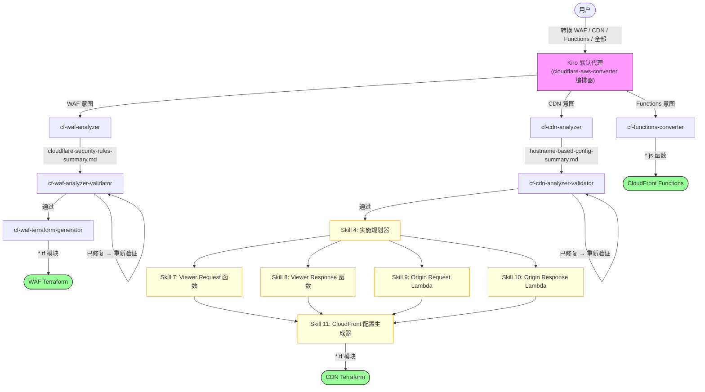

# Cloudflare to AWS Edge 迁移工具 | [English](./README.md)

**通过 AI 对话自动将 Cloudflare 配置转换为 AWS 边缘服务配置**

---

## ⚠️ 重要：必需的输入格式

**此工具仅适用于由 [CloudflareBackup](https://github.com/chenghit/CloudflareBackup) 生成的配置文件。**

**❌ 不兼容 [cf-terraforming](https://github.com/cloudflare/cf-terraforming)** — cf-terraforming 要求用户手动指定输出文件名和路径，产生不可预测的文件结构，AI 技能无法可靠处理。详见 [为什么不用 cf-terraforming？](./docs/why-not-cf-terraforming.md)。

---

## 为什么使用此工具

从 Cloudflare 迁移到 AWS 时手动转换数百条规则既耗时又容易出错。此工具利用 GenAI 能力通过对话交互自动化批量配置转换，将迁移时间从数天缩短到数小时。

## 功能

| 技能 | 输入 | 输出 | 状态 |
|-------|-------|--------|--------|
| **cf-waf-analyzer** | Cloudflare 安全规则（WAF、速率限制、IP 访问等） | 安全规则摘要和转换计划 | ✅ 可用 |
| **cf-waf-analyzer-validator** | 安全规则摘要 | 已验证的摘要（就地修复错误） | ✅ 可用 |
| **cf-waf-terraform-generator** | 已验证的安全规则摘要 | AWS WAF 配置（Terraform） | ✅ 可用 |
| **cf-functions-converter** | Cloudflare 转换规则（重定向、URL 重写、标头转换等） | CloudFront Functions（JavaScript） | ✅ 可用 |
| **cf-cdn-analyzer** | Cloudflare CDN 配置（缓存、源站、重定向等） | 基于主机名的配置摘要 | ✅ 可用 |
| **cf-cdn-analyzer-validator** | 基于主机名的配置摘要 | 已验证的摘要（就地修复错误） | ✅ 可用 |

每个技能在独立的 Kiro 子代理中运行，具有隔离的上下文。默认代理加载 `cloudflare-aws-converter` 编排器技能，自动调度到对应的子代理。你不需要了解这些内部架构——只需描述你的需求，Kiro 会自动处理。



## 快速开始

```bash
# 1. 安装 Kiro CLI
curl -fsSL https://cli.kiro.dev/install | bash

# 2. 备份 Cloudflare 配置
# 使用：https://github.com/chenghit/CloudflareBackup

# 3. 安装技能
git clone https://github.com/chenghit/cloudflare-aws-edge-config-converter.git
cd cloudflare-aws-edge-config-converter
./install.sh

# 4. 开始转换
kiro-cli chat
```

直接描述你的需求：

```
将 /path/to/cloudflare-backup 中的 Cloudflare 安全规则转换为 AWS WAF
将 /path/to/cloudflare-backup 中的转换规则转换为 CloudFront Functions
分析 /path/to/cloudflare-backup 中的 CDN 配置
将 /path/to/cloudflare-backup 中的所有 Cloudflare 配置转换为 AWS
```

Kiro 自动调用对应的子代理，无需手动 `/agent swap`。

测试时可使用 `examples/cloudflare-configs/`。

完整对话示例：[examples/conversation-history/](examples/conversation-history/)

## 前提条件

### Terraform

AWS WAF 输出需要 Terraform >= 1.8.0（AWS Provider 6.x 依赖）。

```bash
terraform version
# 升级：https://developer.hashicorp.com/terraform/install
```

### Kiro CLI

- 安装：https://kiro.dev/docs/getting-started/installation/
- 技能支持：自 1.24 版本起
- ⚠️ 不推荐 Kiro IDE — 不支持子代理中的 `skill://` 资源绑定，会破坏上下文隔离。

### 模型选择

> ⚠️ **最低要求模型：`claude-sonnet-4.6`**
>
> 更早的模型能看到技能元数据但不会加载完整的 SKILL.md 正文，导致任务失败。

- `claude-sonnet-4.6` — 推荐用于 < 100 条规则
- `claude-sonnet-4.6-1m` — 用于 > 100 条规则或多域名 CDN 迁移。在 Kiro 中使用 `/model` 切换。

## 安装

```bash
git clone https://github.com/chenghit/cloudflare-aws-edge-config-converter.git
cd cloudflare-aws-edge-config-converter
./install.sh    # 将技能复制到 ~/.kiro/skills/，子代理配置复制到 ~/.kiro/agents/
```

更新：`git pull && ./install.sh`

### 手动子代理控制

高级用户可使用 `/agent swap <子代理名称>` 手动运行各个阶段。可用：`cf-waf-analyzer`、`cf-waf-analyzer-validator`、`cf-waf-terraform-generator`、`cf-functions-converter`、`cf-cdn-analyzer`、`cf-cdn-analyzer-validator`。

## 更多信息

- [最佳实践](./docs/best-practices.md)
- [限制和注意事项](./docs/limitations.md)
- [故障排除](./docs/troubleshooting.md)
- [为什么不用 cf-terraforming？](./docs/why-not-cf-terraforming.md)
- [路线图](./docs/roadmap.md)
- [架构设计](./docs/architecture/)

## 相关资源

- [Kiro 文档](https://kiro.dev/docs/)
- [Kiro CLI 中的代理技能支持](https://kiro.dev/changelog/cli/1-24/)
- [AWS WAF 文档](https://docs.aws.amazon.com/waf/)
- [CloudFront Functions 文档](https://docs.aws.amazon.com/AmazonCloudFront/latest/DeveloperGuide/cloudfront-functions.html)

## 许可证

[MIT](./LICENSE)

## 反馈和贡献

如有问题或建议，请提交 Issue 或 Pull Request。
