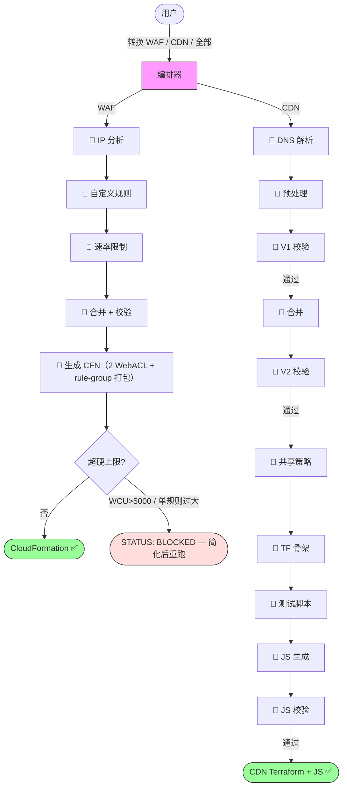

# Cloudflare 到 AWS 边缘服务迁移工具 | [English](./README.md)

**通过 AI 对话，自动将 Cloudflare 配置转换为 AWS 边缘服务配置**

本工具读取 Cloudflare 配置备份（由 `backup/` 目录里自带的备份脚本生成），生成可直接部署的 AWS WAF（CloudFormation）和 CloudFront（Terraform）配置——包括缓存策略、CloudFront Functions、Lambda@Edge 和 KVS 数据。

## 快速开始

无需安装。克隆仓库，然后让你的 AI agent（Claude Code、Kiro CLI、Codex、Cursor 等）来驱动它。

```bash
git clone https://github.com/chenghit/cloudflare-aws-edge-config-converter.git
```

首先，让 agent 认识这个仓库，它才知道怎么驱动流程：

```
阅读 /path/to/cloudflare-aws-edge-config-converter 里的 AGENTS.md。
```

它会读取 `AGENTS.md` → `converter/SKILL.md`，然后就准备好了。

**接下来，你需要一份 Cloudflare 配置备份**——转换器读取的是这份备份，它自己不会去调 Cloudflare API。如果你还没有，本仓库的 `backup/` 目录里有生成脚本，agent 会指导你运行它（它不会看到你的 API 凭据——凭据由你自己配置）。详见 [获取备份](#获取备份)。已经有备份了？直接把路径告诉 agent。

然后让 agent 转换：

```
把我在 /path/to/cloudflare-backup 的 Cloudflare 配置转换到 AWS。
```

你可以指定范围：

```
将 /path/to/cloudflare-backup 中的 Cloudflare 安全规则转换为 AWS WAF
将 /path/to/cloudflare-backup 中的 CDN 配置转换为 CloudFront Terraform
将 /path/to/cloudflare-backup 中的全部 Cloudflare 配置转换到 AWS
```

转换完成后，每条 pipeline 都会生成一份报告——CDN 是 `conversion_report.md`，WAF 是 `README_aws-waf-deployment.md`——里面写清了所有部署步骤、配额关切和需要手动处理的事项。你可以接着让 agent 帮你部署，例如：

```
读取转换报告，帮我部署到 AWS。
```

agent 会按报告里的部署步骤操作（Terraform apply / CloudFormation），并先告诉你有哪些手动前置。**CDN 特别注意：部署前先在 us-east-1 准备好 ACM 证书**。每个 distribution 需要一张 SAN 能覆盖它的证书。一层通配符只覆盖一层，`*.example.com` 覆盖 `www.example.com`，但四级子域名 `app.eu.example.com` 需要 `*.eu.example.com`。工具生成的 `resolve-certs.py` 会按 SAN 覆盖把你已签发的证书匹配到每个域名并填好 ARN；哪个域名没有能覆盖它的证书，它会停下来明确告诉你要签什么。批准前请先看一遍报告，部署什么由你掌控。

请始终提供 **备份根目录**（包含 `account/` 和 zone 子目录如 `example.com/` 的那个目录）。**不要**提供子目录——WAF 和 CDN pipeline 都需要 `account/` 目录中的文件（WAF 需要 IP 列表，CDN 需要 bulk redirect 列表），这些文件位于 zone 目录之外。

如需在没有自己配置的情况下测试，可使用 `examples/cloudflare-configs/`。

## 前提条件

- **一个 AI 编码 agent** — Claude Code、Kiro CLI、Codex、Cursor，或任何能读取 markdown 文件并运行 shell 命令的 agent。agent 只需要理解用户意图、运行脚本，以及为非英文用户翻译部署文档。支持 Agent Skills 格式的工具（Kiro CLI、Claude Code）会自动发现 `converter/SKILL.md`；其他工具读取 `AGENTS.md`（很多工具会自动读取），或由你指给它。
- **Terraform** >= 1.8.0，AWS Provider >= 6.x — [安装 Terraform](https://developer.hashicorp.com/terraform/install)。仅 CDN pipeline 需要。WAF pipeline 使用 CloudFormation（不需要 Terraform）。
- **Python 3** — WAF 和 CDN pipeline 的脚本都需要。WAF pipeline 完全基于 Python（表达式解析、分析、验证、CloudFormation 生成）。CDN 用 Python 做规则预处理、IR 校验和合并（Stage 3–7.6）。macOS 和大多数 Linux 发行版已预装。转换流程无需第三方包（仅用标准库）。**部署阶段**：有 KVS 的 CDN 域名（批量重定向、IP 列表、错误页面）会生成 `seed-kvs.py` 脚本，需要**带 CRT 扩展的 `boto3`**（CloudFront KeyValueStore 的 SigV4a 签名依赖它）——部署前运行 `pip install 'boto3[crt]'`（记得加引号）安装。只装普通 `boto3` 会在 seeding 时报签名错误。
- **模型**：转换 pipeline 本身无模型要求——所有脚本都是确定性 Python，零 LLM 调用。
- **备份步骤需要**：`bash`、`curl` 和 `jq`。详见 `backup/README.md`。
- **ACM 证书**（仅 CDN）：CloudFront 要求证书位于 us-east-1。部署前先申请好 SAN 能覆盖各域名的证书。一层通配符只覆盖一层，`*.example.com` 覆盖 `www.example.com`，四级子域名 `app.eu.example.com` 则需要 `*.eu.example.com`（一张证书可以同时挂这两个 SAN）。工具生成的 `resolve-certs.py` 会按 SAN 覆盖把已签发的证书匹配到每个域名，把 ARN 填进各域名工具独占的 `certs.auto.tfvars.json`；在 `terraform apply` 前运行它，或用 `-var cert_arn_<san>=arn:...` 覆盖某个选择。
- **输入格式**：支持由自带的 `backup/` 脚本生成的备份。不兼容 [cf-terraforming](https://github.com/cloudflare/cf-terraforming)——详见 [为何不用 cf-terraforming？](./docs/why-not-cf-terraforming.md)

## 转换范围

| Cloudflare | AWS 等价物 | 流程 |
|------------|-----------|------|
| WAF 规则、速率限制、IP 访问控制 | AWS WAF Web ACL (CloudFormation) | WAF |
| 缓存规则 | CloudFront 缓存策略 + 缓存行为 | CDN |
| 源站规则 | CloudFront Functions (`updateRequestOrigin`) 或缓存行为 | CDN |
| 重定向规则 | CloudFront Functions (viewer-request) | CDN |
| URL 重写规则 | CloudFront Functions (viewer-request) | CDN |
| 批量重定向 | KVS + CloudFront Functions | CDN |
| 请求头转换 | CloudFront Functions + Origin Request Policy | CDN |
| 响应头转换 | Response Headers Policy + CloudFront Functions | CDN |
| 压缩规则 | 缓存策略 `enable_gzip` / `enable_brotli` | CDN |
| 自定义错误规则 | CloudFront 自定义错误响应 | CDN |
| Cloud Connector 规则 | 独立缓存行为 + 独立源站 | CDN |

并非所有 Cloudflare 功能都有 CloudFront 等价物。无法转换的项目会记录在 `conversion_report.md` 中供人工审查——不会被静默丢弃。完整列表见 [限制与注意事项](./docs/limitations.md)。

## 工作原理

你的 AI agent 读取 `converter/SKILL.md`，作为编排器调度确定性 Python 脚本完成 WAF 和 CDN 两条 pipeline。

**WAF 流程**（全 Python，零 LLM）：分析 IP 列表 → 分析自定义规则 → 分析速率限制 → 合并 → 校验 → 生成 CloudFormation（**rule-group overflow packer 让每个 WebACL 保持在 AWS 硬限制内**）

WAF pipeline 默认生成 2 个 WebACL（website + api）。一个 rule-group overflow packer 把超出的速率规则和 IP set 引用移入被引用的 rule group，从而让每个 WebACL 保持在 AWS 的硬性上限内——每 WebACL 最多 10 条速率规则、50 条引用语句（rule group 内的规则不占用这两个上限，整个 rule group 只算 WebACL 的 1 条引用）。因此引用超过 50 不再强制 per-domain 拆分。`--force-split`（每个代理域名一个 WebACL，剥离 host 条件）仍可按需使用，它同样走这个 packer。每个 WebACL 包含搜索引擎标签规则（Googlebot/Bingbot/YandexBot）、Anti-DDoS（排除搜索引擎）和 always-on challenge 规则（Count 模式——用户确认后手动改为 Challenge）。只有当某个 WebACL 的 WCU 超过 5000 硬上限、或单条规则复杂到无法装入一个 rule group 时才无法部署，此时工具报告 `STATUS: BLOCKED`（模板仍会写出供检查）。

**CDN 流程**（0 个 LLM 阶段 + 10 个 Python 脚本）：**🐍 解析 DNS + 生成域名配置** → **🐍 预处理规则** → **🐍 校验 IR** → **🐍 合并去重** → **🐍 校验最终 IR** → **🐍 生成共享策略** → **🐍 生成每域名 Terraform 骨架** → **🐍 生成每域名测试脚本** → **🐍 生成每域名 JS** → **🐍 校验 JS**

所有 CDN 阶段都是确定性 Python 脚本，零 LLM 调用，转换过程零用户交互。Stage 1 自动解析 DNS 并生成 `domain_scope.json`。证书 ARN 在部署时由生成的 `resolve-certs.py` 按 ACM SAN 覆盖填入，不再靠 Terraform data source 去猜。整个工具（WAF + CDN）完全不依赖模型。



**转换全自动：** 转换过程无需用户交互。DNS 解析自动生成域名配置。部署时由 `resolve-certs.py` 按 SAN 覆盖把你在 us-east-1 已签发的证书匹配到每个域名、填好 ARN（想改某个选择就用 `-var cert_arn_<san>=...`）。

## CDN 流程详情

<details>
<summary>输出目录结构</summary>

```
cloudflare-to-aws-cdn/
├── dns_manifest.yaml
├── domain_scope.json
├── conversion_report.md             # 不可转换规则 + 警告
├── ir/                              # 中间表示（仅调试用）
│   ├── accumulator/
│   ├── final/
│   └── validation/
└── terraform/
    ├── modules/
    │   └── cloudfront_distribution/ # 共享模块（勿编辑）
    ├── shared/
    │   └── policies.tf              # 去重后的 CachePolicy、ORP、RHP
    └── domains/
        └── <域名>/
            ├── main.tf              # Module call（约 50-80 行）
            ├── outputs.tf
            ├── functions.tf
            ├── kvs.tf               # 仅当有批量重定向时
            ├── functions/
            │   └── viewer_request.js
            └── lambda/              # 仅当某条 default-cache-TTL 规则需要时
```

</details>

<details>
<summary>部署顺序</summary>

共享策略 → Lambda@Edge（如有）→ 各域名独立部署 → KVS 数据导入 → DNS 切换。详见 [部署指南](./docs/deployment-guide.md)。

</details>

<details>
<summary>扩展性与限速</summary>

- **设计目标：** 已测试最多 54 个代理域名。更大的 zone 也应该可以工作——Python 脚本在单次调用中处理所有域名。
- **每次转换一个 zone。** 如果备份含多个域名（很正常——`config.example` 自带两个），agent 会逐个转换到各自独立的输出目录，无需重新备份。
- **CFF 配额：** 默认 100 个/账号。Content-hash 去重自动共享相同 CFF（如 54 域名 → 5 CFF）。仅当大量域名有独立 CFF 逻辑时才需关注。
- **KVS 配额：** 默认 50 个/账号（软限制）。Content-hash 去重自动共享相同 KVS（如 54 域名 → 2 KVS）。去重后仍超限请[申请提额](https://docs.aws.amazon.com/servicequotas/latest/userguide/request-quota-increase.html)。

</details>

<details>
<summary>预计转换时间</summary>

转换时间取决于规则/域名数量。以下基准使用项目自带的 `examples/cloudflare-configs/`（1 个 zone、54 个代理域名、80+ 条 CDN 规则 + 20 条 WAF 规则，覆盖 12+ 种规则类型——包括正则表达式、OR 条件、地理路由、CORS、批量重定向、内联错误页面和 KV 存储数据）：

| 流程 | 时间 |
|------|------|
| WAF | <1 秒（全 Python，无 LLM） |
| CDN | <1 秒（全 Python，无 LLM，全自动） |

时间分布：
- **WAF**：全 Python pipeline，总计 <1 秒（无 LLM 调用）。
- **CDN**：全部 10 个 Python 阶段总计 <1 秒。全自动，无用户交互。

影响因素：
- **域名数量**不影响大部分阶段（Python 一次处理所有域名）。

</details>

<details>
<summary>ACM 证书</summary>

CloudFront 要求 TLS 证书位于 **us-east-1**。一张证书能不能覆盖某个域名，看它的 SAN 里有没有精确匹配、或者同级通配符。`*.example.com` 覆盖 `www.example.com`，但覆盖不了顶级域 `example.com`，也覆盖不了更深一层的 `app.eu.example.com`（那个要 `*.eu.example.com`）。一张证书可以挂多个 SAN。部署前申请：

```bash
aws acm request-certificate \
  --domain-name "example.com" \
  --subject-alternative-names "*.example.com" "*.eu.example.com" \
  --validation-method DNS \
  --region us-east-1
```

每个 distribution 从 `cert_arn_<san>` 这个 Terraform 变量读 ARN。在 `terraform/` 目录下运行生成的 `resolve-certs.py`，它会列出你在 us-east-1 已签发的证书，按 SAN 覆盖匹配到每个域名，把 ARN 写进该域名自己的 `domains/<san>/certs.auto.tfvars.json`——这是工具独占、Terraform 自动加载的文件（纯 JSON，不解析 HCL，所以不会碰你自己文件里的注释或 heredoc）。已有的值只在仍然有效（仍是 ISSUED、且仍覆盖该 host）时才复用；失效的 ARN（证书过期/删除，或 SAN 不再覆盖）会被删除并重新匹配。哪个域名没有能覆盖它的证书，就删掉可能残留的旧文件并停下来列出要签什么——所以 BLOCKED 时是真正 fail-closed。想改某个选择，就在该域名目录 apply 时加 `-var 'cert_arn_<san>=arn:...'`，不要去改生成的 JSON。`cert_arn_<san>` 为空时 `terraform plan` 会失败，并提示这个域名到底需要哪种 SAN 覆盖。

</details>

<details>
<summary>本工具不配置的内容</summary>

- **CloudFront 访问日志** — 涉及 S3 桶决策，超出迁移范围。如需要，自行在 `main.tf` 中添加 `logging_config`。
- **DNS 切换** — 创建了 distribution 但不修改 DNS 记录。

</details>

<details>
<summary>需要了解的 AWS WAF 配额</summary>

- **每个 WebACL 的引用语句数**：50（**硬限制**，不可提额；IP set + regex set + rule group + 托管规则组引用都计入）
- **每个 WebACL 的速率规则数**：10（**硬限制**）
- **每个 WebACL 的 WCU**：5000（**硬限制**，超过 1500 产生额外费用）
- **每账号每区域 IP set 数量**：100（软限制，可申请提额）
- **每账号每区域 WebACL 数量**：100（软限制）

Pipeline 默认生成 2 个 WebACL，用 rule-group overflow packer 把超出的速率规则和 IP set 引用移入被引用的 rule group，从而保持在 10 条速率规则 / 50 条引用的硬上限内（rule group 内的引用不计入这两个上限）。在 `--force-split` 模式下，当 inline IP set 超过 100 时启用跨规则 IP set 去重。生成的部署手册包含 Quota Usage 表格。详见 [为什么用 CloudFormation](./docs/why-cloudformation_CN.md)。

</details>

## 获取备份

如果你还没有备份，使用 `backup/` 里自带的脚本：

```bash
cd backup
cp config.example config
# 编辑 config：填入你的 API Token（或 Global API Key）和域名——详见 backup/README.md
./cloudflare_backup.sh          # macOS/Linux；Windows 用户通过 WSL 运行
```

这会生成 `<zone>/<timestamp>/` 和 `account/<timestamp>/` 目录——那个父目录就是你要交给转换器的路径。你的凭据只存在本地 `config` 文件里，AI agent 绝不会读取或索取。

备份脚本就在 `backup/` 目录里——它是本仓库的一部分，无需另行安装或克隆。

## 如何运行

**无需安装。** 脚本会自定位，从你克隆仓库的任何位置都能运行。

- **基于 skill 的 agent**（Kiro CLI、Claude Code）：会自动发现 `converter/SKILL.md`——直接开始对话、描述需求即可。
- **其他任何 agent**（Codex、Cursor 等）：让它读取 `AGENTS.md`（很多工具会自动读取）并按其操作。

agent 会建立三个路径——`$REPO`（克隆目录）、`$OUT`（你选定的输出工作目录）、`$CONFIG_PATH`（你的备份）——然后运行流程。输出写入 `$OUT`，绝不写进仓库内部。

高级用户可直接运行各流程阶段：都是 `converter/scripts/` 下的纯 Python/Bash 脚本。WAF pipeline 通过 `waf-pipeline.sh` 运行；CDN 各阶段是独立脚本。确切的调用顺序见 `converter/SKILL.md`。

## 更多信息

- [最佳实践](./docs/best-practices_CN.md)
- [部署指南](./docs/deployment-guide_CN.md)
- [限制与注意事项](./docs/limitations_CN.md)
- [故障排除](./docs/troubleshooting_CN.md)
- [为何不用 cf-terraforming？](./docs/why-not-cf-terraforming_CN.md)
- [为什么 WAF 用 CloudFormation 而不是 Terraform？](./docs/why-cloudformation_CN.md)

## 相关资源

- [Kiro 文档](https://kiro.dev/docs/)
- [Kiro CLI Agent Skills 支持](https://kiro.dev/changelog/cli/1-24/)
- [AWS WAF 文档](https://docs.aws.amazon.com/waf/)
- [CloudFront 开发者指南](https://docs.aws.amazon.com/AmazonCloudFront/latest/DeveloperGuide/)
- [CloudFront Functions Runtime 2.0](https://docs.aws.amazon.com/AmazonCloudFront/latest/DeveloperGuide/functions-javascript-runtime-20.html)

## 许可证

[MIT](./LICENSE)

## 反馈与贡献

如有问题或建议，欢迎提交 Issue 或 Pull Request。
